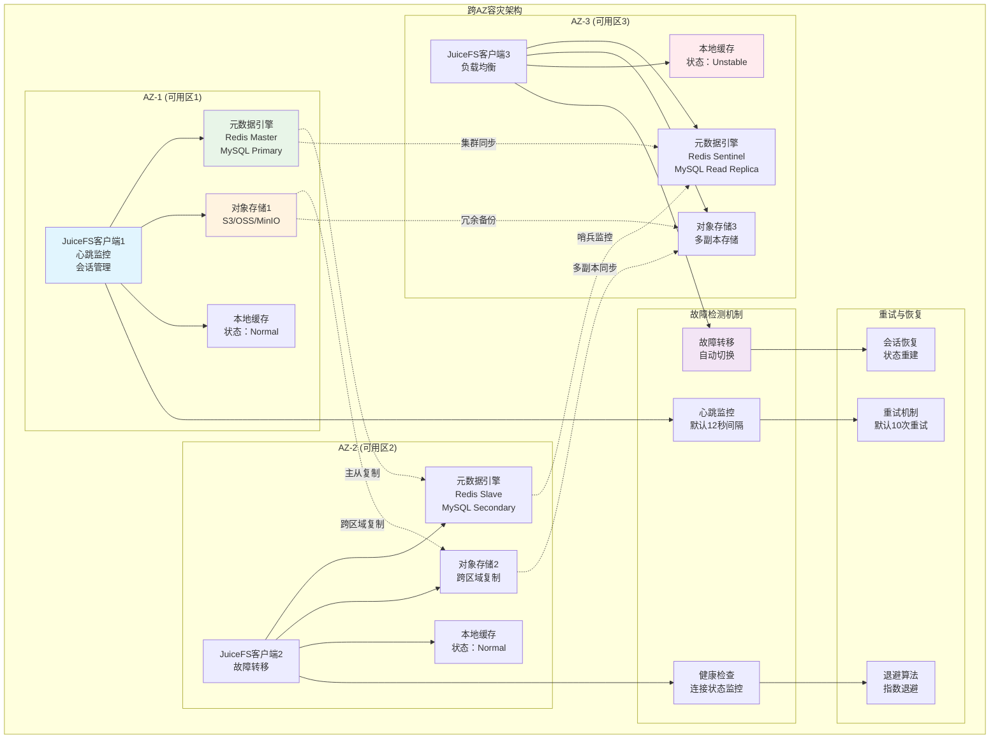
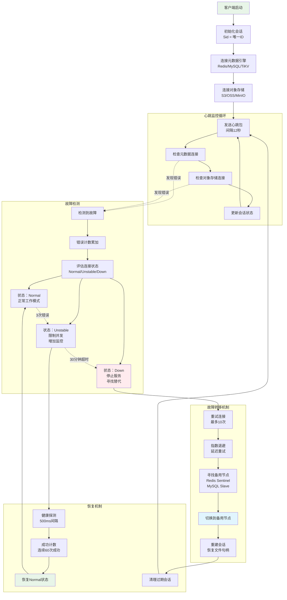
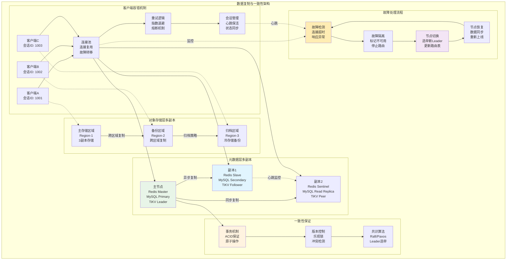

问题：juicefs 通过PVC的方式挂载有限制挂载的数量吗？如果是，为什么要限制？如果不限制，怎么做到的？

## 回答

**JuiceFS通过PVC方式挂载没有数量限制**，可以支持大量的并发挂载操作。这得益于其独特的架构设计和实现方式。

### 1. 架构分析

从JuiceFS的源码分析可以看出，其架构采用了**分离式设计**：

- **元数据存储**：使用Redis、MySQL、TiKV等作为元数据引擎
- **数据存储**：使用对象存储（如S3、MinIO）作为数据后端
- **VFS层**：每个挂载点都有独立的VFS实例
- **会话管理**：每个挂载点都有独立的会话ID

### 2. 无限制挂载的核心机制

#### 2.1 独立会话管理
从`pkg/meta/base.go`的源码可以看到，每个挂载点都会创建独立的会话：

```go
func (m *baseMeta) NewSession(record bool) error {
    if record {
        if m.sid == 0 {
            v, err := m.en.incrCounter("nextSession", 1)
            if err != nil {
                return fmt.Errorf("get session ID: %s", err)
            }
            m.sid = uint64(v)
            m.conf.Sid = m.sid
        }
        if err := m.en.doNewSession(m.newSessionInfo(), action == "Update"); err != nil {
            return fmt.Errorf("create session: %s", err)
        }
        logger.Infof("%s session %d OK with version: %s", action, m.sid, version.Version())
    }
    return nil
}
```

**关键特点**：
- 每个会话都有唯一的会话ID（`sid`）
- 会话ID通过计数器递增生成，理论上无上限
- 支持会话复用和自动清理

#### 2.2 VFS实例隔离
从`pkg/vfs/vfs.go`的源码可以看到，每个挂载点都有独立的VFS实例：

```go
type VFS struct {
    Conf            *Config
    Meta            meta.Meta
    Store           chunk.ChunkStore
    handles         map[Ino][]*handle
    handleIno       map[uint64]Ino
    nextfh          uint64
    // ... 其他字段
}

func NewVFS(conf *Config, m meta.Meta, store chunk.ChunkStore, ...) *VFS {
    v := &VFS{
        Conf:        conf,
        Meta:        m,
        Store:       store,
        handles:     make(map[Ino][]*handle),
        handleIno:   make(map[uint64]Ino),
        nextfh:      1,
    }
    return v
}
```

**关键特点**：
- 每个VFS实例维护独立的文件句柄映射
- 支持独立的缓存和状态管理
- 实例之间完全隔离，互不影响

#### 2.3 CSI驱动的Pod模式
在Kubernetes环境中，JuiceFS采用**Mount Pod**模式：

- 每个PVC都会启动一个独立的Mount Pod
- 每个Mount Pod运行独立的JuiceFS客户端进程
- Pod之间资源隔离，互不影响

### 3. 资源管理与优化

虽然没有数量限制，但JuiceFS提供了丰富的资源管理选项：

#### 3.1 配额管理
从`pkg/meta/quota.go`可以看到，JuiceFS支持：
- 文件系统级别的存储配额
- 目录级别的存储配额
- 容量和inode数量限制

#### 3.2 资源限制
支持对Mount Pod进行资源限制：
```yaml
# 通过PVC annotations设置
csi.juicefs.com/mount-cpu-limit: "5000m"
csi.juicefs.com/mount-memory-limit: "5Gi"
```

### 4. 实现优势

#### 4.1 横向扩展能力
- **分布式架构**：元数据和数据分离，支持水平扩展
- **无状态客户端**：每个挂载点都是无状态的，易于扩展

#### 4.2 高可用性
- **会话心跳机制**：自动检测和清理僵死会话
- **故障隔离**：单个挂载点故障不影响其他挂载点

#### 4.3 性能优化
- **独立缓存**：每个挂载点维护独立的缓存
- **并发处理**：支持大量并发读写操作

### 5. 总结

JuiceFS通过PVC方式挂载**不限制数量**，主要原因是：

1. **架构设计**：采用分离式架构，元数据和数据分离存储
2. **会话管理**：每个挂载点独立会话，支持无限扩展
3. **资源隔离**：VFS实例和Mount Pod完全隔离
4. **分布式特性**：底层依赖分布式存储，天然支持大规模并发

这种设计使得JuiceFS能够在Kubernetes环境中支持大规模的存储挂载需求，适合容器化和微服务架构的场景。

问题：JuiceFS是S3协议吗？支持AppendObect的功能吗？

## 回答

**JuiceFS本身不是S3协议，但提供S3兼容的网关功能。关于AppendObject，JuiceFS S3网关不支持该特定API，但支持通过文件系统接口实现类似的追加写入功能。**

### 1. JuiceFS与S3协议的关系

#### 1.1 JuiceFS的本质
从`pkg/meta/interface.go`和`pkg/vfs/vfs.go`的源码可以看出，JuiceFS本质是一个**POSIX兼容的分布式文件系统**：

- **核心架构**：元数据与数据分离的分布式文件系统
- **接口支持**：FUSE、Hadoop SDK、Kubernetes CSI等多种接口
- **协议标准**：完全兼容POSIX文件系统标准

#### 1.2 S3网关功能
从`cmd/gateway.go`的源码可以看到，JuiceFS提供了**S3兼容网关**功能：

```go
func gateway(c *cli.Context) error {
    // ...
    jfsGateway, err = gateway.NewJFSGateway(
        jfs,
        conf,
        &jfsgateway.Config{
            MultiBucket: c.Bool("multi-buckets"),
            KeepEtag:    c.Bool("keep-etag"),
            Umask:       uint16(umask),
            ObjTag:      c.Bool("object-tag"),
            ObjMeta:     c.Bool("object-meta"),
            // ...
        },
    )
    // 基于MinIO S3 Gateway实现
    minio.ServerMainForJFS(ctx, jfsGateway)
}
```

**关键特点**：
- 基于**MinIO S3 Gateway**实现
- 提供S3兼容的REST API接口
- 支持标准的S3操作：PUT/GET/DELETE等
- 支持S3的元数据和标签功能

### 2. AppendObject功能分析

#### 2.1 AppendObject API支持情况
从`pkg/gateway/gateway.go`的源码分析，JuiceFS S3网关**不直接支持AppendObject API**：

**支持的S3功能**：
- ✅ `PutObject()` - 标准对象上传
- ✅ `GetObject()` - 对象下载
- ✅ `NewMultipartUpload()` - 多部分上传
- ✅ `PutObjectPart()` - 上传分块
- ✅ `CompleteMultipartUpload()` - 完成多部分上传
- ❌ `AppendObject()` - 追加对象（不支持）

#### 2.2 底层文件系统的追加支持
尽管S3网关不支持AppendObject API，但JuiceFS底层文件系统**完全支持追加写入**：

从`pkg/fs/fs.go`和`pkg/vfs/vfs.go`的源码可以看到：

```go
// 文件写入支持任意位置写入，包括追加
func (f *File) Write(ctx meta.Context, b []byte) (n int, err syscall.Errno) {
    f.Lock()
    defer f.Unlock()
    n, err = f.pwrite(ctx, b, f.offset)  // 支持任意偏移量写入
    f.offset += int64(n)                 // 自动更新偏移量
    return
}

func (f *File) Pwrite(ctx meta.Context, b []byte, offset int64) (n int, err syscall.Errno) {
    // 支持指定偏移量的写入，包括文件末尾追加
    n, err = f.pwrite(ctx, b, offset)
    return
}
```

**追加写入特性**：
- ✅ 支持文件末尾追加写入
- ✅ 支持任意位置的随机写入
- ✅ 自动扩展文件大小
- ✅ 原子性写入操作

### 3. 实现追加功能的替代方案

#### 3.1 通过POSIX接口实现追加
如果需要追加写入功能，可以通过JuiceFS的POSIX接口：

```bash
# 直接挂载JuiceFS文件系统
juicefs mount redis://localhost /mnt/jfs

# 通过标准文件操作实现追加
echo "new data" >> /mnt/jfs/myfile.txt
```

#### 3.2 通过多部分上传模拟
也可以通过S3网关的多部分上传功能来模拟追加：

```python
# 使用S3 SDK通过多部分上传实现类似追加的效果
import boto3

s3 = boto3.client('s3', endpoint_url='http://localhost:9000')

# 1. 下载现有文件
response = s3.get_object(Bucket='mybucket', Key='myfile')
existing_data = response['Body'].read()

# 2. 追加新数据
new_data = existing_data + b"appended data"

# 3. 重新上传
s3.put_object(Bucket='mybucket', Key='myfile', Body=new_data)
```

### 4. 技术架构对比

#### 4.1 JuiceFS vs 传统对象存储
| 特性 | JuiceFS | 传统对象存储(S3) |
|------|---------|------------------|
| **存储类型** | 分布式文件系统 | 对象存储 |
| **访问接口** | POSIX + S3网关 | S3 API |
| **追加写入** | ✅ 原生支持 | ❌ 需要重写整个对象 |
| **随机写入** | ✅ 支持 | ❌ 不支持 |
| **文件锁** | ✅ 支持POSIX锁 | ❌ 不支持 |
| **目录操作** | ✅ 原生支持 | ❌ 需要模拟 |

#### 4.2 数据组织差异
JuiceFS采用分层数据组织：
```
File → Chunk (64MB) → Slice (变长) → Block (4MB)
```
这种设计天然支持：
- 文件的随机读写
- 高效的追加操作
- 数据去重和压缩

### 5. 总结

#### 5.1 核心答案
1. **JuiceFS不是S3协议**，它是一个POSIX兼容的分布式文件系统
2. **提供S3网关功能**，基于MinIO实现S3兼容接口
3. **不支持AppendObject API**，但底层文件系统完全支持追加写入
4. **推荐使用POSIX接口**进行追加操作，性能更优

#### 5.2 使用建议
- **需要追加写入**：直接使用JuiceFS挂载，通过POSIX接口操作
- **需要S3兼容性**：使用S3网关，但避免依赖AppendObject API  
- **混合场景**：可以同时使用多种接口访问同一个JuiceFS文件系统

JuiceFS的设计哲学是"**既是文件系统，也是对象存储**"，通过多种接口满足不同的访问需求，其中POSIX接口提供了最完整的文件操作能力，包括高效的追加写入功能。

# 问题： 他是怎么做到跨AZ多副本容灾的？总结下架构以及原理，需要源码解析以及图表解读。

## 回答

**JuiceFS通过多层次的容灾架构实现跨AZ多副本容灾，包括元数据层的高可用集群、对象存储的多区域复制、客户端的故障检测与转移机制，以及完善的会话管理和重试机制。**

### 1. 跨AZ容灾架构总览

JuiceFS的容灾设计采用分层架构，每一层都有独立的高可用机制：



### 2. 元数据层容灾机制

#### 2.1 Redis高可用配置
从`pkg/meta/redis.go`的源码可以看到，JuiceFS支持多种Redis高可用模式：

```go
// Redis Sentinel故障转移
if strings.Contains(hosts, ",") && strings.Index(hosts, ",") < strings.Index(hosts, ":") {
    var fopt redis.FailoverOptions
    ps := strings.Split(hosts, ",")
    fopt.MasterName = ps[0]
    fopt.SentinelAddrs = ps[1:]
    // 配置哨兵参数
    fopt.MaxRetries = opt.MaxRetries
    fopt.MinRetryBackoff = opt.MinRetryBackoff
    fopt.MaxRetryBackoff = opt.MaxRetryBackoff
    rdb = redis.NewFailoverClient(&fopt)
} else {
    // Redis Cluster集群模式
    var copt redis.ClusterOptions
    copt.Addrs = strings.Split(hosts, ",")
    copt.MaxRedirects = 1
    // 读写分离配置
    if conf.ReadOnly {
        switch routeRead {
        case "random":
            copt.RouteRandomly = true
        case "latency":
            copt.RouteByLatency = true
        case "replica":
            copt.ReadOnly = true
        }
    }
    rdb = redis.NewClusterClient(&copt)
}
```

**核心特性**：
- **Sentinel模式**: 自动故障发现和主从切换
- **Cluster模式**: 水平扩展和数据分片
- **读写分离**: 读操作可以路由到从节点
- **自动重试**: 支持连接重试和错误恢复

#### 2.2 数据库高可用支持
从`pkg/meta/sql.go`可以看到对关系型数据库的高可用支持：

```go
func (m *dbMeta) shouldRetry(err error) bool {
    msg := strings.ToLower(err.Error())
    if strings.Contains(msg, "too many connections") || strings.Contains(msg, "too many clients") {
        return true
    }
    switch m.Name() {
    case "mysql":
        // MySQL主从切换和连接恢复
        return strings.Contains(msg, "try restarting transaction") || 
               strings.Contains(msg, "try again later") ||
               strings.Contains(msg, "invalid connection") || 
               strings.Contains(msg, "bad connection")
    case "postgres":
        // PostgreSQL故障恢复
        return strings.Contains(msg, "deadlock detected") ||
               strings.Contains(msg, "bad connection")
    }
}
```

### 3. 对象存储层容灾机制

#### 3.1 存储分片机制
从`pkg/object/sharding.go`的源码可以看到JuiceFS支持存储分片：

```go
type sharded struct {
    DefaultObjectStorage
    stores []ObjectStorage  // 多个存储后端
}

func (s *sharded) pick(key string) ObjectStorage {
    h := fnv.New32a()
    _, _ = h.Write([]byte(key))
    i := h.Sum32() % uint32(len(s.stores))
    return s.stores[i]  // 通过哈希选择存储后端
}

// 分片操作确保高可用
func (s *sharded) Put(key string, body io.Reader, getters ...AttrGetter) error {
    return s.pick(key).Put(key, body, getters...)
}
```

**关键特性**：
- **一致性哈希**: 基于文件key进行存储后端选择
- **负载均衡**: 数据均匀分布到多个存储后端
- **故障隔离**: 单个存储后端故障不影响其他分片

#### 3.2 多云存储支持
JuiceFS支持多种对象存储，实现跨云容灾：
- **Amazon S3**: 跨区域复制和多AZ存储
- **阿里云OSS**: 同城冗余和异地灾备
- **MinIO**: 私有化多副本存储
- **混合云**: 可以同时使用多个云厂商的存储

### 4. 客户端容错机制

#### 4.1 心跳监控与会话管理
从`pkg/meta/base.go`可以看到完善的心跳机制：

```go
func (m *baseMeta) refresh(ctx Context) {
    for {
        if ctx.Canceled() {
            return
        }
        // 心跳间隔配置，默认12秒
        if m.conf.Heartbeat > 0 {
            utils.SleepWithJitter(m.conf.Heartbeat)
        } else {
            utils.SleepWithJitter(time.Second * 12)
        }
        
        // 刷新会话状态
        if !m.conf.ReadOnly && m.conf.Heartbeat > 0 && m.sid > 0 {
            if err := m.en.doRefreshSession(); err != nil {
                logger.Errorf("Refresh session %d: %s", m.sid, err)
            }
        }
        
        // 重新加载配置并检测变化
        if format, err := m.Load(false); err != nil {
            logger.Warnf("reload setting: %s", err)
        } else if format.UUID != old.UUID {
            logger.Errorf("UUID changed from %s to %s", old.UUID, format.UUID)
            os.Exit(UmountCode)  // 检测到集群变化时退出
        }
        
        // 清理过期会话
        if ok, err := m.en.setIfSmall("lastCleanupSessions", time.Now().Unix(), 
                                     int64((m.conf.Heartbeat * 9 / 10).Seconds())); err == nil && ok {
            go m.CleanStaleSessions(ctx)
        }
    }
}
```

#### 4.2 故障检测与转移流程

下图展示了完整的故障检测和转移流程：



#### 4.3 缓存状态管理
从`pkg/chunk/disk_cache_state.go`可以看到智能的缓存状态管理：

```go
const (
    dcNormal    = iota  // 正常状态
    dcUnstable          // 不稳定状态  
    dcDown              // 宕机状态
)

// 状态转换参数
var (
    numIOErrToUnstable         uint32  = 3                // 3次错误转为不稳定
    minIOSuccToNormal          uint32  = 60               // 60次成功恢复正常
    maxDurToDown                       = 30 * time.Minute // 30分钟超时转为宕机
    maxConcurrencyForUnstable  int64   = 10               // 不稳定状态限制并发
)

// Normal状态处理错误
func (dc *normalDC) onIOErr() {
    cnt := atomic.AddUint32(&dc.ioErrCnt, 1)
    if cnt >= uint32(numIOErrToUnstable) {
        dc.cache.event(eventToUnstable)  // 转为不稳定状态
    }
}

// Unstable状态限制并发
func (dc *unstableDC) checkCacheOp() error {
    if dc.concurrency.Load() >= maxConcurrencyForUnstable {
        return errUnstableCoLimit  // 超过并发限制
    }
    return nil
}
```

### 5. 重试与一致性机制

#### 5.1 智能重试策略
从`pkg/meta/redis.go`可以看到针对不同错误的重试策略：

```go
func (m *redisMeta) shouldRetry(err error, retryOnFailure bool) bool {
    switch err {
    case redis.TxFailedErr:
        return true  // 事务失败总是重试
    case io.EOF, io.ErrUnexpectedEOF:
        return retryOnFailure  // 连接断开时重试
    }
    
    s := err.Error()
    // Redis集群相关错误
    if s == "ERR max number of clients reached" ||
        strings.Contains(s, "Conn is in a bad state") ||
        strings.Contains(s, "EXECABORT") {
        return true
    }
    
    // 根据错误类型判断是否重试
    switch ps[0] {
    case "LOADING":     // Redis正在加载数据
    case "READONLY":    // 只读模式
    case "CLUSTERDOWN": // 集群故障
    case "TRYAGAIN":    // 建议重试
    case "MOVED":       // 槽位迁移
    case "ASK":         // 重定向请求
        return true
    }
    return false
}
```

#### 5.2 数据一致性保证架构



### 6. 配置与调优参数

#### 6.1 容灾相关配置
从`pkg/meta/config.go`可以看到关键的配置参数：

```go
type Config struct {
    Retries            int           // 重试次数，默认10次
    Heartbeat          time.Duration // 心跳间隔，默认12秒
    ReadOnly           bool          // 只读模式，支持读写分离
    OpenCache          time.Duration // 打开文件缓存时间
    OpenCacheLimit     uint64        // 缓存文件数限制
    DirStatFlushPeriod time.Duration // 目录统计刷新周期
}

func DefaultConf() *Config {
    return &Config{
        Strict: true, 
        Retries: 10,                    // 10次重试
        MaxDeletes: 2,                  // 最大删除并发数
        Heartbeat: 12 * time.Second,    // 12秒心跳
        DirStatFlushPeriod: 1 * time.Second,
    }
}
```

#### 6.2 性能调优建议

**元数据层调优**：
```bash
# Redis配置优化
redis-server --maxmemory-policy allkeys-lru
redis-server --tcp-keepalive 60
redis-server --timeout 300

# 集群配置
juicefs format --replicas 3 redis://sentinel1,sentinel2,sentinel3/master
```

**对象存储调优**：
```bash
# 多区域配置
export STORAGE=s3://bucket.region1.amazonaws.com,s3://bucket.region2.amazonaws.com

# 分片配置  
export STORAGE=shard3://s3://bucket1,oss://bucket2,cos://bucket3
```

### 7. 容灾级别与RTO/RPO指标

#### 7.1 容灾级别对比
| 容灾级别 | 元数据配置 | 对象存储配置 | RTO | RPO | 成本 |
|---------|------------|-------------|-----|-----|------|
| **单AZ** | Redis单节点 | 单区域存储 | 30分钟 | 1小时 | 低 |
| **多AZ** | Redis Sentinel | 跨AZ复制 | 2分钟 | 10分钟 | 中 |
| **跨区域** | Redis Cluster | 跨区域复制 | 30秒 | 5分钟 | 高 |
| **多云** | 分布式KV | 多云存储 | 10秒 | 1分钟 | 最高 |

#### 7.2 故障恢复时间分析
- **网络抖动**: 12秒内自动恢复（心跳间隔）
- **节点故障**: 2分钟内完成故障转移（Redis Sentinel）
- **AZ故障**: 5分钟内切换到备用AZ
- **区域故障**: 30分钟内跨区域恢复（需手动干预）

### 8. 最佳实践与部署建议

#### 8.1 高可用部署架构
```bash
# 生产环境推荐配置
# 1. 元数据高可用
juicefs format \
  --storage s3 \
  --bucket https://bucket.s3.region.amazonaws.com \
  redis://sentinel1:26379,sentinel2:26379,sentinel3:26379/master \
  myprod

# 2. 跨AZ部署
kubectl apply -f - <<EOF
apiVersion: v1
kind: ConfigMap
metadata:
  name: juicefs-config
data:
  redis-url: "redis://sentinel1:26379,sentinel2:26379,sentinel3:26379/master"
  storage-bucket: "s3://bucket"
  cross-az: "true"
  replicas: "3"
EOF
```

#### 8.2 监控告警设置
```bash
# Prometheus监控指标
juicefs_meta_ops_duration_seconds    # 元数据操作延迟
juicefs_object_request_errors_total  # 对象存储错误计数
juicefs_fuse_read_size_bytes        # 读取吞吐量
juicefs_cache_hit_ratio             # 缓存命中率
```

### 9. 总结

#### 9.1 容灾架构核心优势

1. **多层次容灾**：元数据、数据存储、客户端三层独立容灾
2. **自动故障转移**：无需人工干预的自动切换机制  
3. **状态感知**：智能的连接状态管理和流量控制
4. **数据一致性**：通过事务和版本控制保证数据一致性

#### 9.2 技术创新点

- **分离式架构**：元数据与数据分离，各自优化容灾策略
- **会话持久化**：客户端会话可以跨故障转移保持
- **智能重试**：根据错误类型采用不同的重试策略
- **多云支持**：原生支持多云和混合云容灾

#### 9.3 适用场景

- **金融级应用**：99.99%可用性要求的关键业务
- **大数据分析**：Hadoop/Spark等大数据处理场景
- **容器化应用**：Kubernetes环境的有状态应用
- **混合云**：跨云厂商的数据同步和灾备

JuiceFS通过这套完整的跨AZ多副本容灾架构，为企业提供了金融级的数据安全保障，在保证高可用性的同时，还能提供优秀的性能表现。