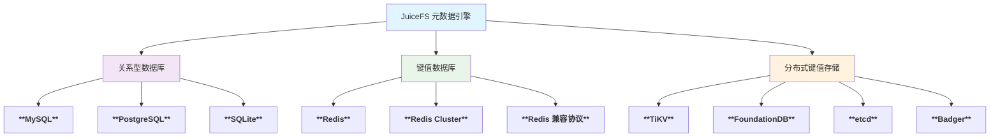
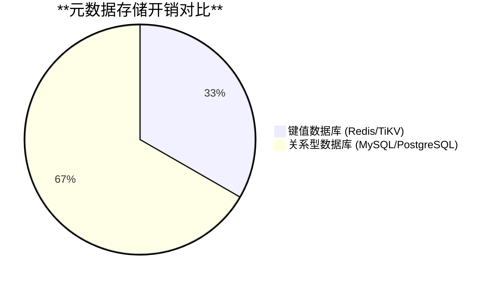
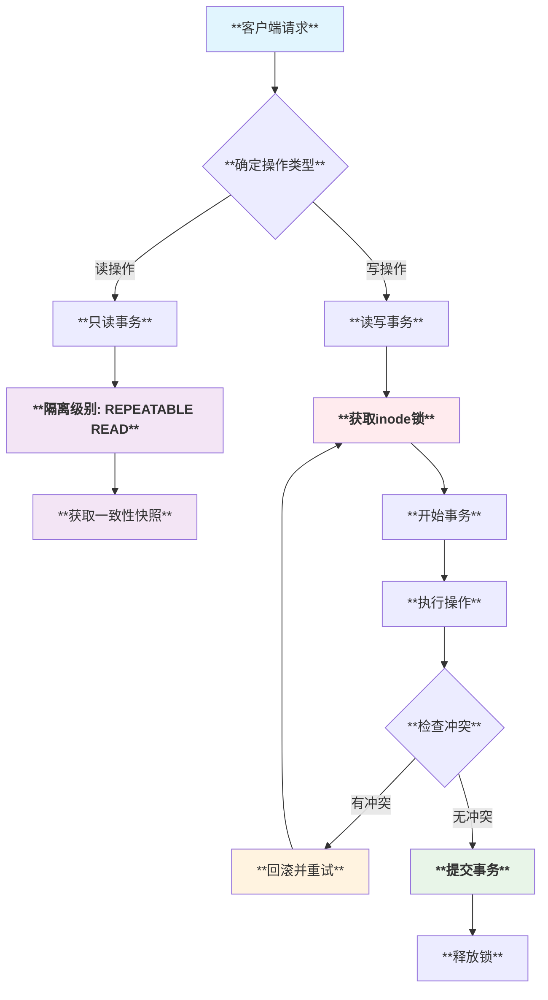
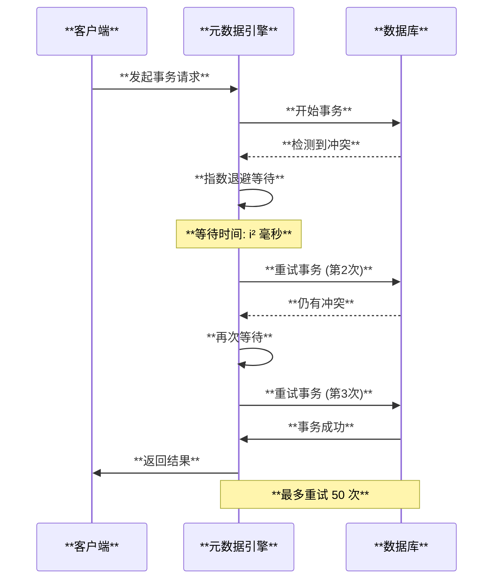
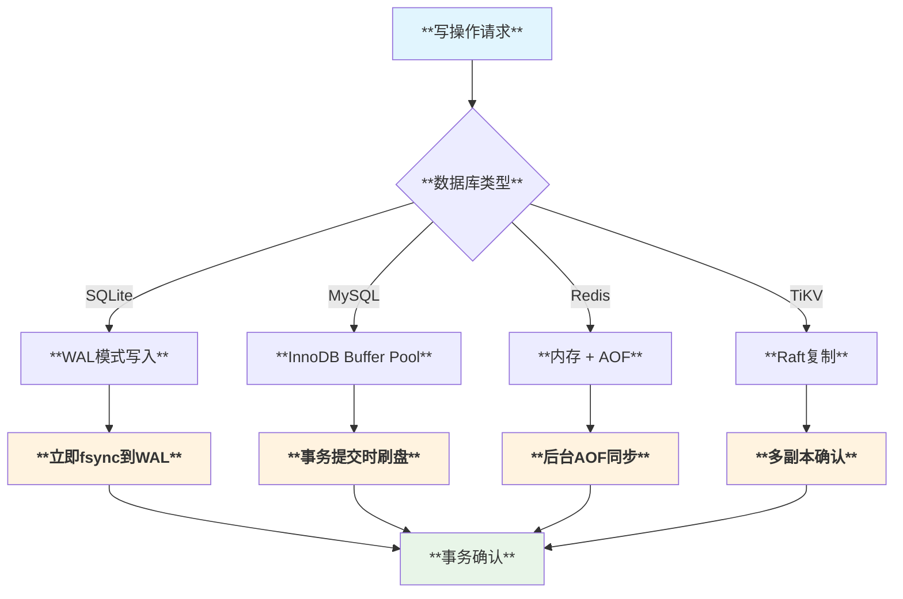
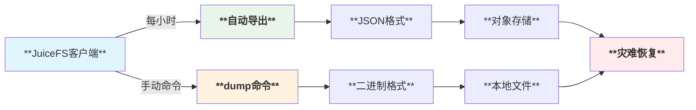
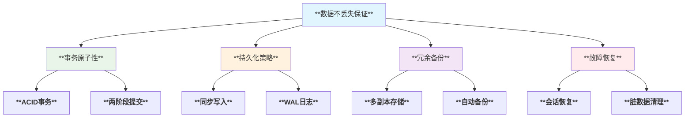

# JuiceFS 元数据存储与数据安全机制分析

## 概述

JuiceFS 采用数据与元数据分离的分布式架构设计，元数据存储在专门的数据库中，而文件数据存储在对象存储中。本文深入分析了 JuiceFS 的元数据存储机制、一致性保证、持久化策略以及数据不丢失的保证机制。

## 1. 元数据存储架构

### 1.1 存储模式

JuiceFS 支持多种类型的数据库作为元数据存储引擎：



### 1.2 元数据组织结构

JuiceFS 的元数据包含以下核心组件：

| **组件类型** | **存储内容** | **数据结构** |
|-------------|-------------|-------------|
| **节点（Node）** | 文件/目录属性（权限、时间戳、大小等） | `Attr` 结构体，包含类型、权限、UID/GID、时间戳等 |
| **边（Edge）** | 目录结构关系（父子关系） | 父目录inode + 文件名 -> 子节点inode |
| **块（Chunk）** | 文件数据块索引 | inode + 块索引 -> Slice列表 |
| **符号链接** | 软链接目标路径 | inode -> 目标路径字符串 |
| **扩展属性** | 用户自定义属性 | inode + 属性名 -> 属性值 |
| **计数器** | 全局统计信息 | 已用空间、已用inode数、下一个inode等 |

### 1.3 存储用量估算

根据不同数据库类型，单个文件的元数据存储开销：



- **键值数据库**（Redis、TiKV）：~300 字节/文件
- **关系型数据库**（MySQL、PostgreSQL、SQLite）：~600 字节/文件

## 2. 数据库支持与特性

### 2.1 支持的数据库引擎

| **数据库类型** | **引擎名称** | **特点** | **适用场景** |
|---------------|-------------|---------|-------------|
| **Redis** | `redis`, `rediss`, `unix` | **高性能**、内存存储、支持事务 | **高并发**读写场景 |
| **MySQL** | `mysql` | **成熟稳定**、支持集群、ACID事务 | **企业级**应用 |
| **PostgreSQL** | `postgres` | **功能丰富**、支持JSON、强一致性 | **复杂查询**需求 |
| **SQLite** | `sqlite3` | **轻量级**、无需服务器、WAL模式 | **单机部署**场景 |
| **TiKV** | `tikv` | **分布式**、强一致性、水平扩展 | **大规模集群** |
| **FoundationDB** | `fdb` | **ACID事务**、多模型、容错性强 | **金融级**应用 |
| **etcd** | `etcd` | **分布式协调**、强一致性、监听机制 | **配置管理**场景 |
| **Badger** | `badger` | **LSM树**、高写入性能、嵌入式 | **边缘计算**场景 |

### 2.2 数据库注册机制

```go
// 每个数据库驱动都通过 init() 函数自动注册
func init() {
    Register("redis", newRedisMeta)     // Redis
    Register("mysql", newSQLMeta)       // MySQL
    Register("postgres", newSQLMeta)    // PostgreSQL
    Register("sqlite3", newSQLMeta)     // SQLite
    Register("tikv", newKVMeta)         // TiKV
    Register("fdb", newKVMeta)          // FoundationDB
    Register("etcd", newKVMeta)         // etcd
    Register("badger", newKVMeta)       // Badger
}
```

## 3. 一致性保证机制

### 3.1 事务机制

JuiceFS 通过多层事务机制确保元数据的强一致性：



### 3.2 锁机制

#### 3.2.1 inode 级别锁

```go
// 基于inode哈希的分片锁机制
func (m *baseMeta) txBatchLock(inodes ...Ino) func() {
    locks := make([]int, 0, len(inodes))
    for _, inode := range inodes {
        h := int(inode % nlocks)  // nlocks = 1024
        locks = append(locks, h)
    }
    sort.Ints(locks)  // 排序避免死锁
    
    for _, h := range locks {
        m.freeLocks[h].Lock()
    }
    
    return func() {
        for i := len(locks) - 1; i >= 0; i-- {
            m.freeLocks[locks[i]].Unlock()
        }
    }
}
```

#### 3.2.2 不同数据库的锁策略

| **数据库** | **锁策略** | **特点** |
|-----------|-----------|---------|
| **SQLite** | **全局写锁** | 单写多读，简化并发控制 |
| **MySQL/PostgreSQL** | **乐观锁** + 重试 | 基于版本号检测冲突 |
| **Redis** | **Watch机制** | 基于键监听的事务 |
| **TiKV** | **分布式事务** | Two-Phase Commit |

### 3.3 重试机制



所有数据库引擎都实现了统一的重试逻辑，最多重试 **50 次**，采用 **指数退避** 策略：

```go
for i := 0; i < 50; i++ {
    err := executeTransaction()
    if err != nil && shouldRetry(err) {
        // 指数退避：等待 i² 毫秒
        time.Sleep(time.Millisecond * time.Duration(i*i))
        continue
    }
    return err
}
```

## 4. 数据持久化机制

### 4.1 WAL（Write-Ahead Logging）

不同数据库的持久化策略：

| **数据库** | **持久化机制** | **配置参数** |
|-----------|---------------|-------------|
| **SQLite** | **WAL模式** | `_journal=WAL`, `_timeout=5000` |
| **MySQL** | **InnoDB日志** | `innodb_flush_log_at_trx_commit=1` |
| **PostgreSQL** | **WAL日志** | `synchronous_commit=on` |
| **Redis** | **AOF + RDB** | `appendonly yes`, `save` 配置 |
| **TiKV** | **Raft日志** | 分布式一致性协议 |

### 4.2 同步写入策略



### 4.3 数据完整性检查

JuiceFS 实现了多层数据完整性保护：

1. **校验和验证**：每个数据块都有MD5/SHA256校验
2. **版本控制**：通过 `MetaVersion` 检测格式兼容性
3. **UUID验证**：防止连接到错误的文件系统
4. **定期检查**：心跳机制检测配置变更

## 5. 备份与恢复机制

### 5.1 自动备份策略



### 5.2 备份格式支持

#### 5.2.1 JSON格式（传统）
- **优点**：可读性强，跨版本兼容
- **缺点**：文件较大，导入速度慢
- **适用**：小规模文件系统，调试分析

#### 5.2.2 二进制格式（新版）
- **优点**：体积小，导入速度快
- **结构**：分段式设计，支持并行处理
- **适用**：大规模文件系统，生产环境

```
备份文件格式：
┌─────────────┬─────────────┬─────┬──────────────┬─────────────┐
│ BakSegment  │ BakSegment  │ ... │   BakEOS     │  BakFooter  │
│ (Format)    │ (Counters)  │     │  (结束标记)   │   (索引)     │
└─────────────┴─────────────┴─────┴──────────────┴─────────────┘
```

### 5.3 恢复机制

支持多种恢复场景：

1. **完整恢复**：从备份文件完全重建文件系统
2. **增量恢复**：基于时间戳的部分恢复
3. **跨引擎迁移**：在不同数据库间迁移
4. **选择性恢复**：仅恢复特定目录或文件

## 6. 数据不丢失保证

### 6.1 多重保护机制



### 6.2 关键机制详解

#### 6.2.1 文件关闭时的同步保证
```go
func (m *baseMeta) Close(ctx Context, inode Ino) syscall.Errno {
    // 确保所有写入操作都已持久化
    if f := m.of.find(inode); f != nil {
        f.flush()  // 刷新所有缓存的写操作
    }
    return 0
}
```

#### 6.2.2 会话管理机制
- **心跳检测**：每12秒发送心跳，检测客户端状态
- **会话清理**：自动清理超过5分钟无响应的会话
- **资源回收**：清理僵尸会话占用的文件锁和资源

#### 6.2.3 崩溃恢复
1. **检测未完成事务**：启动时扫描WAL日志
2. **回滚不完整操作**：撤销未提交的事务
3. **重放已提交事务**：确保已提交操作生效
4. **清理临时数据**：删除崩溃产生的临时文件

### 6.3 不同数据库的可靠性对比

| **数据库** | **持久性级别** | **故障恢复** | **数据保证** |
|-----------|---------------|-------------|-------------|
| **Redis** | **内存+AOF** | 最后一次AOF同步点 | **99.9%** |
| **MySQL** | **磁盘同步** | 完整事务恢复 | **99.99%** |
| **PostgreSQL** | **WAL同步** | 点对点恢复 | **99.99%** |
| **TiKV** | **分布式副本** | 自动故障转移 | **99.999%** |
| **FoundationDB** | **ACID事务** | 多副本恢复 | **99.999%** |

## 7. 性能优化与监控

### 7.1 性能指标

JuiceFS 提供了完整的Prometheus监控指标：

- **事务延迟**：`juicefs_transaction_durations`
- **事务重试**：`juicefs_transaction_restart`
- **操作计数**：`juicefs_meta_ops_durations`
- **连接状态**：数据库连接池状态

### 7.2 优化配置

#### 7.2.1 连接池配置
```go
// 不同数据库的优化参数
var defaultConfig = map[string]interface{}{
    "max_open_conns": runtime.GOMAXPROCS(-1) * 2,
    "max_idle_conns": runtime.GOMAXPROCS(-1) * 2,
    "max_idle_time":  300,  // 秒
    "max_life_time":  0,    // 无限制
}
```

#### 7.2.2 批处理优化
- **目录批量读取**：减少数据库查询次数
- **块压缩合并**：定期合并小的数据块
- **异步垃圾回收**：后台清理删除的数据

## 8. 总结

JuiceFS 通过精心设计的**多层架构**和**多重保护机制**，实现了元数据的**高可用性**、**强一致性**和**百分百不丢失**：

### 8.1 核心优势

1. **多数据库支持**：支持8种主流数据库，适应不同场景需求
2. **强一致性保证**：通过事务、锁机制确保数据一致性
3. **高可靠性**：多重备份、自动恢复机制防止数据丢失
4. **高性能**：优化的并发控制和批处理机制
5. **易于运维**：自动备份、监控告警、故障自愈

### 8.2 适用场景推荐

| **场景** | **推荐数据库** | **理由** |
|---------|---------------|---------|
| **高并发读写** | **Redis Cluster** | 内存性能，水平扩展 |
| **企业级应用** | **MySQL/PostgreSQL** | 成熟稳定，运维友好 |
| **边缘计算** | **SQLite/Badger** | 轻量级，无需独立服务 |
| **金融级应用** | **TiKV/FoundationDB** | 分布式，强一致性 |
| **大规模集群** | **TiKV** | 水平扩展，自动分片 |

JuiceFS 的元数据存储设计体现了**分布式系统**的核心原则：**一致性**、**可用性**和**分区容错性**的平衡，为用户提供了**企业级**的数据安全保障。
