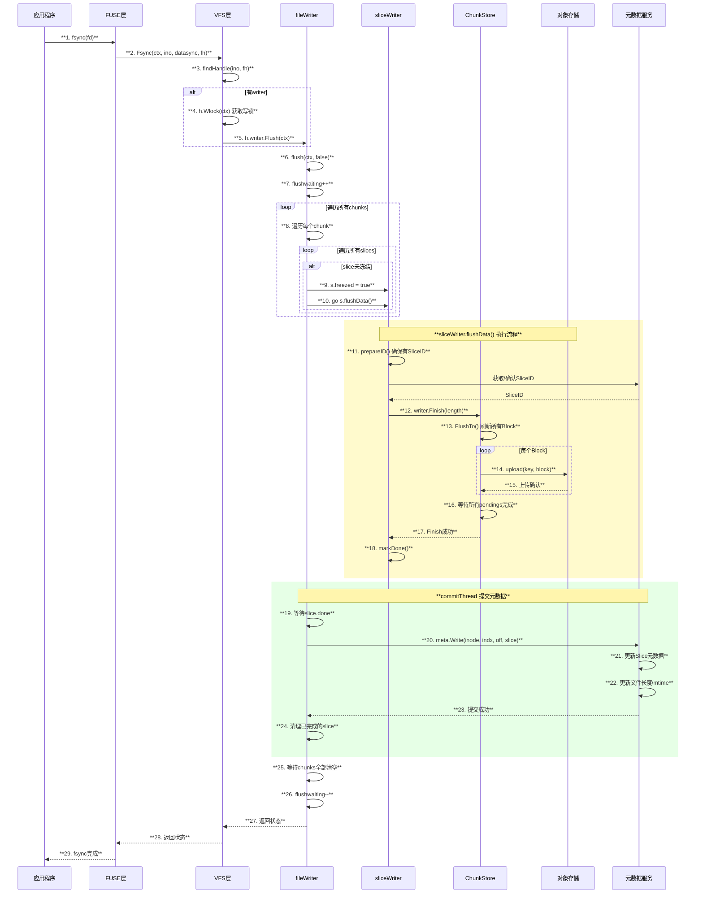
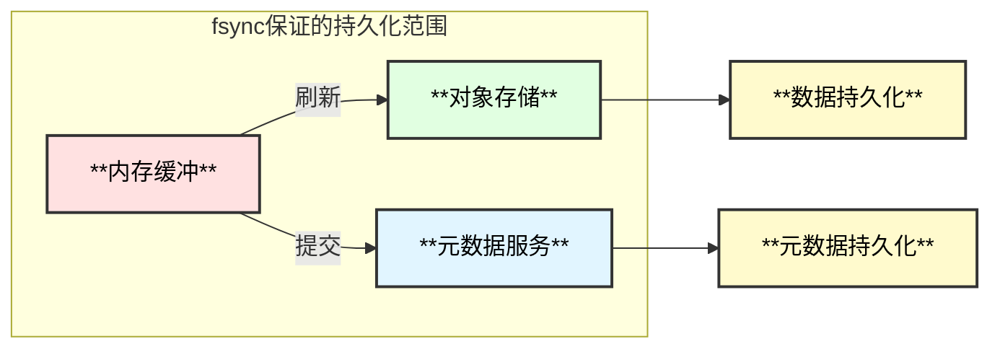
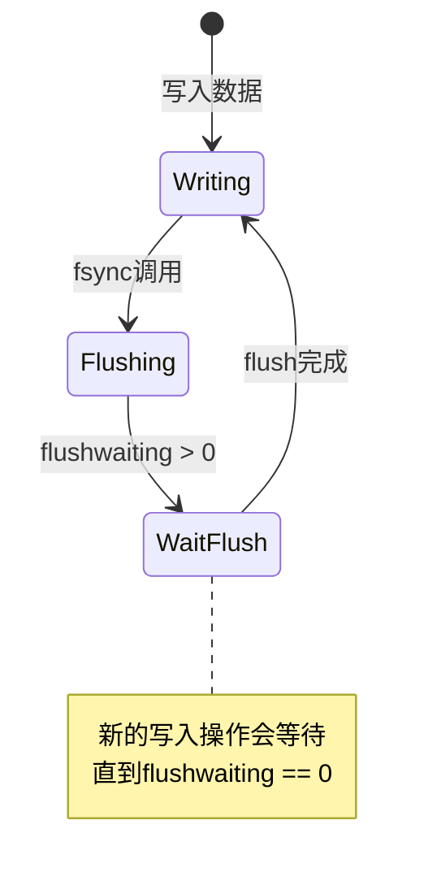

# JuiceFS fsync 系统调用实现分析

## 概述

`fsync` 是 POSIX 标准的系统调用，用于将文件的所有修改（包括数据和元数据）同步到持久存储。在 JuiceFS 中，fsync 确保所有缓冲的写入数据都上传到对象存储，并且相应的元数据已提交到元数据服务。

## 架构图

```mermaid
graph TB
    subgraph "用户态"
        A[**应用程序<br/>fsync()**]
    end
    
    subgraph "FUSE 层"
        B[**go-fuse<br/>Fsync Handler**]
    end
    
    subgraph "VFS 层"
        C[**VFS.Fsync<br/>虚拟文件系统**]
        D[**Handle<br/>文件句柄**]
    end
    
    subgraph "Writer 层"
        E[**fileWriter<br/>Flush操作**]
        F[**chunkWriter<br/>等待Slice完成**]
        G[**sliceWriter<br/>flushData**]
    end
    
    subgraph "ChunkStore 层"
        H[**wSlice<br/>Finish操作**]
        I[**Block上传<br/>等待完成**]
    end
    
    subgraph "持久化"
        J[**对象存储<br/>PUT完成确认**]
        K[**元数据服务<br/>Write提交**]
    end
    
    A --> B
    B --> C
    C --> D
    D --> E
    E --> F
    F --> G
    G --> H
    H --> I
    I -->|等待| J
    G -->|等待| K
    
    style A fill:#ffe1e1,stroke:#333,stroke-width:2px,color:#000
    style B fill:#e1ffe1,stroke:#333,stroke-width:2px,color:#000
    style C fill:#e1f5ff,stroke:#333,stroke-width:2px,color:#000
    style D fill:#e1f5ff,stroke:#333,stroke-width:2px,color:#000
    style E fill:#fff3e1,stroke:#333,stroke-width:2px,color:#000
    style F fill:#fff3e1,stroke:#333,stroke-width:2px,color:#000
    style G fill:#fff3e1,stroke:#333,stroke-width:2px,color:#000
    style H fill:#f5e1ff,stroke:#333,stroke-width:2px,color:#000
    style I fill:#f5e1ff,stroke:#333,stroke-width:2px,color:#000
    style J fill:#fffacd,stroke:#333,stroke-width:2px,color:#000
    style K fill:#fffacd,stroke:#333,stroke-width:2px,color:#000
```

## 时序图



## 函数调用链

```
fsync() - 系统调用入口
└── fs.Fsync() - pkg/fuse/fuse.go:290
    └── VFS.Fsync() - pkg/vfs/vfs.go:1031
        ├── 检查特殊节点 IsSpecialNode()
        ├── findHandle(ino, fh) - 查找文件句柄
        ├── h.Wlock(ctx) - 获取写锁
        └── h.writer.Flush(ctx) - pkg/vfs/writer.go:404
            └── fileWriter.flush() - pkg/vfs/writer.go:354
                ├── flushwaiting++ - 设置flush等待标志
                ├── 计算超时deadline
                │   └── ┌──────────────┬────────────────────────────────────────┐
                │       │  **参数**     │  **说明**                              │
                │       ├──────────────┼────────────────────────────────────────┤
                │       │  wait        │  (maxRetries+2)² / 2 秒，最少5分钟      │
                │       ├──────────────┼────────────────────────────────────────┤
                │       │  deadline    │  now + wait                             │
                │       └──────────────┴────────────────────────────────────────┘
                │
                └── 循环等待所有chunks完成
                    ├── 遍历每个chunk的slices
                    │   └── 冻结并触发刷新
                    │       ├── s.freezed = true
                    │       └── go s.flushData() - pkg/vfs/writer.go:106
                    │           ├── prepareID() - 确保SliceID已分配
                    │           │   └── meta.NewSlice() - 元数据服务分配ID
                    │           ├── s.length = s.slen
                    │           └── writer.Finish(length) - pkg/chunk/cached_store.go:526
                    │               ├── FlushTo(n * BlockSize) - 刷新所有Block
                    │               │   └── upload(i) 上传每个Block
                    │               │       └── store.upload() - pkg/chunk/cached_store.go:386
                    │               │           ├── 压缩数据
                    │               │           ├── store.put(key, buf)
                    │               │           │   └── storage.Put() - 对象存储PUT
                    │               │           └── 重试逻辑 (max tries)
                    │               └── 等待所有pendings - <-s.errors
                    │
                    ├── flushcond.WaitWithTimeout(3s) - 等待条件变量
                    │   └── commitThread发出信号时唤醒
                    │
                    └── 超时检查
                        ├── 超过deadline → 返回EIO
                        └── 打印goroutine堆栈 (调试)

commitThread() - 异步提交线程 - pkg/vfs/writer.go:182
├── 按顺序处理每个slice
│   ├── 等待s.done
│   │   └── notify.WaitWithTimeout(100ms)
│   ├── meta.Write() - 提交元数据
│   │   └── ┌──────────────┬────────────────────────────────────────┐
│   │       │  **操作**     │  **说明**                              │
│   │       ├──────────────┼────────────────────────────────────────┤
│   │       │  更新slice    │  追加slice信息到chunk                  │
│   │       ├──────────────┼────────────────────────────────────────┤
│   │       │  更新length   │  如果文件变长，更新length               │
│   │       ├──────────────┼────────────────────────────────────────┤
│   │       │  更新mtime    │  更新修改时间                          │
│   │       ├──────────────┼────────────────────────────────────────┤
│   │       │  配额检查     │  检查空间配额                          │
│   │       └──────────────┴────────────────────────────────────────┘
│   │
│   └── reader.Invalidate() - 失效读缓存
│
└── freeChunk() - 清理完成的chunk
    └── flushcond.Broadcast() - 唤醒等待的flush
```

## 核心实现分析

### 1. VFS层 Fsync

```go
// pkg/vfs/vfs.go:1031-1054
func (v *VFS) Fsync(ctx Context, ino Ino, datasync int, fh uint64) (err syscall.Errno) {
    defer func() { logit(ctx, "fsync", err, "(%d,%d)", ino, datasync) }()
    
    // 特殊节点无需fsync
    if IsSpecialNode(ino) {
        return
    }
    
    h := v.findHandle(ino, fh)
    if h == nil {
        err = syscall.EBADF
        return
    }
    
    if h.writer != nil {
        // 获取写锁
        if !h.Wlock(ctx) {
            return syscall.EINTR
        }
        defer h.Wunlock()
        defer h.removeOp(ctx)
        
        // 调用Flush同步数据
        err = h.writer.Flush(ctx)
        if err == syscall.ENOENT || err == syscall.EPERM || err == syscall.EINVAL {
            err = syscall.EBADF
        }
    }
    return
}
```

### 2. fileWriter Flush

```go
// pkg/vfs/writer.go:354-402
func (f *fileWriter) flush(ctx meta.Context, writeback bool) syscall.Errno {
    s := time.Now()
    f.Lock()
    defer f.Unlock()
    f.flushwaiting++

    var err syscall.Errno
    // 计算超时时间
    var wait = time.Second * time.Duration((f.w.maxRetries+2)*(f.w.maxRetries+2)/2)
    if wait < time.Minute*5 {
        wait = time.Minute * 5
    }
    var deadline = time.Now().Add(wait)
    
    // 循环等待所有chunks完成
    for len(f.chunks) > 0 && err == 0 {
        // 冻结所有未完成的slice并触发刷新
        for _, c := range f.chunks {
            for _, s := range c.slices {
                if !s.freezed {
                    s.freezed = true
                    go s.flushData()
                }
            }
        }
        
        // 等待条件变量 (commitThread完成时唤醒)
        if f.flushcond.WaitWithTimeout(time.Second*3) && ctx.Canceled() {
            err = syscall.EINTR
            break
        }
        
        // 超时检查
        if time.Now().After(deadline) {
            logger.Errorf("flush %d timeout after waited %s", f.inode, wait)
            err = syscall.EIO
            break
        }
    }
    
    f.flushwaiting--
    if f.flushwaiting == 0 && f.writewaiting > 0 {
        f.writecond.Broadcast()  // 唤醒等待写入的协程
    }
    
    if err == 0 {
        err = f.err
    }
    return err
}
```

### 3. sliceWriter flushData

```go
// pkg/vfs/writer.go:106-124
func (s *sliceWriter) flushData() {
    defer s.markDone()
    
    if s.slen == 0 {
        return
    }
    
    // 确保SliceID已分配
    s.prepareID(meta.Background(), true)
    if s.err != 0 {
        s.writer.Abort()
        return
    }
    
    s.length = s.slen
    // 完成所有数据上传
    if err := s.writer.Finish(int(s.length)); err != nil {
        logger.Errorf("upload inode: %v chunk: %v fail: %s", ...)
        s.writer.Abort()
        s.err = syscall.EIO
    }
}
```

### 4. ChunkStore Finish

```go
// pkg/chunk/cached_store.go:526-542
func (s *wSlice) Finish(length int) error {
    if s.length != length {
        return fmt.Errorf("Length mismatch: %v != %v", s.length, length)
    }
    
    // 计算Block数量并刷新所有Block
    n := (length-1)/s.store.conf.BlockSize + 1
    if err := s.FlushTo(n * s.store.conf.BlockSize); err != nil {
        return err
    }
    
    // 等待所有pending上传完成
    for i := 0; i < s.pendings; i++ {
        if err := <-s.errors; err != nil {
            s.uploadError = err
            return err
        }
    }
    return nil
}
```

## fsync vs Flush 的区别

| 特性 | fsync | Flush (close/fflush) |
|------|-------|---------------------|
| 调用时机 | 应用显式调用 | close()或fflush()时 |
| 锁类型 | 写锁 | 写锁 |
| 底层实现 | 相同(writer.Flush) | 相同(writer.Flush) |
| 语义 | 保证数据持久化 | 保证数据提交 |

## 数据持久化保证



### fsync完成后的保证

1. **数据完整性**：所有写入的数据都已上传到对象存储
2. **元数据一致性**：文件的长度、修改时间等元数据已更新
3. **Slice可见性**：所有Slice信息已提交到元数据服务
4. **读缓存失效**：相关的读缓存已被标记失效

## 超时与错误处理

### 超时计算

```go
// 超时时间 = max(5分钟, (maxRetries+2)² / 2 秒)
var wait = time.Second * time.Duration((f.w.maxRetries+2)*(f.w.maxRetries+2)/2)
if wait < time.Minute*5 {
    wait = time.Minute * 5
}
```

| maxRetries | 计算结果 | 实际超时 |
|------------|---------|---------|
| 0 | 2秒 | 5分钟 |
| 5 | 24.5秒 | 5分钟 |
| 10 | 72秒 | 5分钟 |
| 30 | 512秒 | 8.5分钟 |

### 错误处理

| 错误类型 | 原因 | 处理方式 |
|----------|------|----------|
| EINTR | 上下文取消 | 返回中断错误 |
| EIO | 上传超时 | 打印堆栈，返回IO错误 |
| EBADF | 文件句柄无效 | 错误转换 |

## 并发控制

### flushwaiting 与 writewaiting



- `flushwaiting > 0`：正在进行flush，新的Write操作需要等待
- `writewaiting > 0`：有写入在等待，flush完成后需要Broadcast唤醒

## 性能考量

### 1. 批量提交

fsync 会一次性触发所有未完成 slice 的刷新和上传，而不是逐个处理。

### 2. 并行上传

每个 slice 的 `flushData()` 在独立的 goroutine 中执行，实现并行上传。

### 3. 条件变量等待

使用 `WaitWithTimeout` 避免 busy-waiting，降低 CPU 开销。

### 4. 及时释放

完成的 chunk 立即从 `f.chunks` 中移除，释放内存。

## 最佳实践

1. **避免频繁 fsync**：每次 fsync 都会等待所有数据上传完成
2. **批量写入后 fsync**：累积一定量数据后再调用 fsync
3. **关注超时设置**：根据网络状况调整 maxRetries
4. **监控 flush 耗时**：通过日志监控 flush 的执行时间

