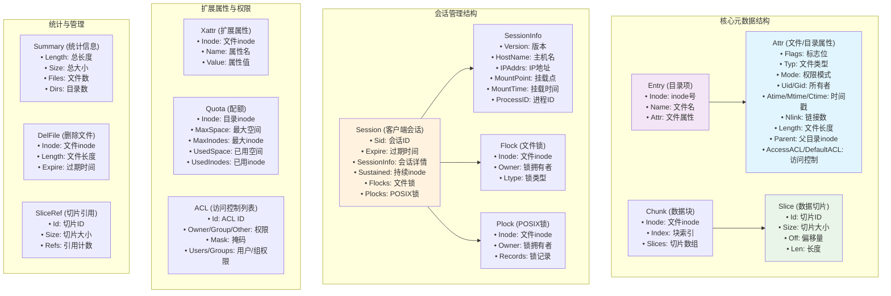
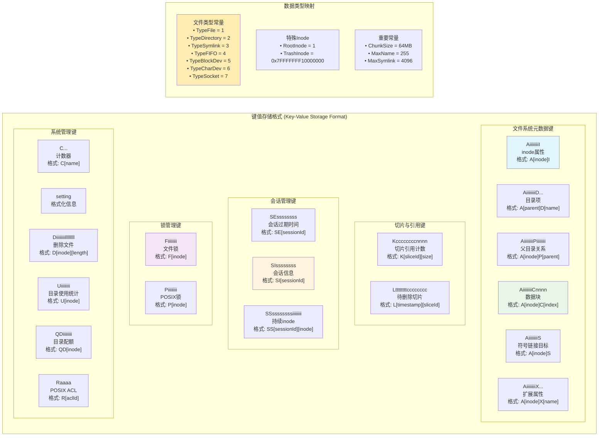
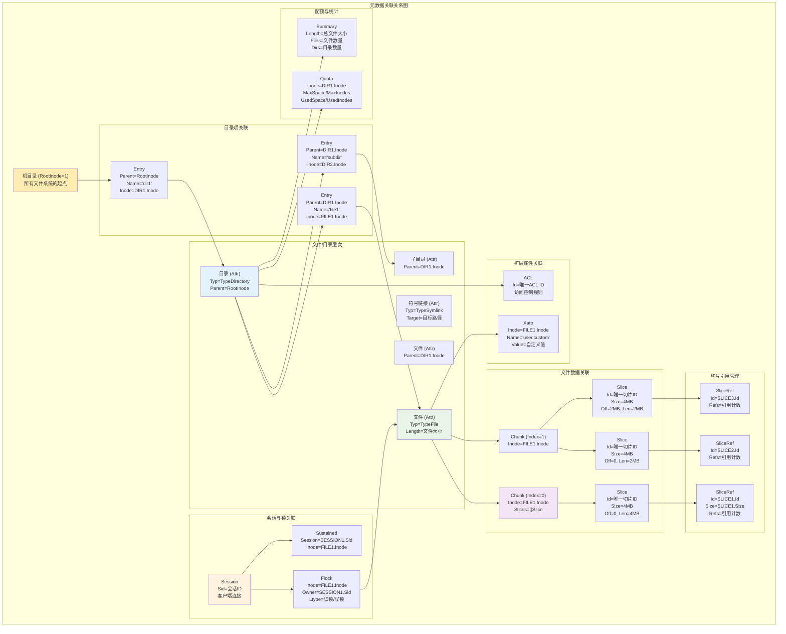

# JuiceFS 元数据结构与存储接口深度分析

## 概述

JuiceFS 作为一个分布式文件系统，其元数据管理是系统的核心组件之一。本文档基于源码分析，深入探讨了 JuiceFS 的元数据结构设计、存储接口架构以及元数据之间的关联关系。

JuiceFS 采用"元数据与数据分离"的架构设计，元数据存储在高性能的数据库中（如Redis、MySQL、TiKV等），而文件数据存储在对象存储中。这种设计使得 JuiceFS 能够充分利用各种存储系统的优势，实现高性能和高可用性。

## 1. 核心元数据结构

### 1.1 元数据结构概览

下图展示了 JuiceFS 中定义的核心元数据结构及其字段组成：



### 1.2 详细结构分析

#### 1.2.1 Attr 结构 - 文件属性的核心

`Attr` 结构是 JuiceFS 中最核心的元数据结构，它包含了文件或目录的所有基本属性：

```go
type Attr struct {
    Flags     uint8  // 文件标志位（不可变、追加等）
    Typ       uint8  // 文件类型（常规文件、目录、符号链接等）
    Mode      uint16 // UNIX权限模式
    Uid       uint32 // 文件所有者用户ID
    Gid       uint32 // 文件所有者组ID
    Rdev      uint32 // 设备号（仅设备文件）
    Atime     int64  // 最后访问时间（秒）
    Mtime     int64  // 最后修改时间（秒）
    Ctime     int64  // 元数据最后变更时间（秒）
    Atimensec uint32 // 访问时间纳秒部分
    Mtimensec uint32 // 修改时间纳秒部分
    Ctimensec uint32 // 变更时间纳秒部分
    Nlink     uint32 // 硬链接数
    Length    uint64 // 文件长度（仅常规文件）
    Parent    Ino    // 父目录inode（用于硬链接管理）
    Full      bool   // 属性是否完整
    KeepCache bool   // 是否保持缓存页面
    AccessACL  uint32 // 访问ACL ID
    DefaultACL uint32 // 默认ACL ID
}
```

**文件类型定义**：
- `TypeFile = 1`: 常规文件
- `TypeDirectory = 2`: 目录
- `TypeSymlink = 3`: 符号链接
- `TypeFIFO = 4`: 命名管道
- `TypeBlockDev = 5`: 块设备
- `TypeCharDev = 6`: 字符设备
- `TypeSocket = 7`: 套接字

#### 1.2.2 Entry 结构 - 目录项管理

`Entry` 结构表示目录中的一个条目，建立了文件名与inode的映射关系：

```go
type Entry struct {
    Inode Ino    // 文件或目录的inode号
    Name  []byte // 文件名或目录名
    Attr  *Attr  // 指向对应的属性结构
}
```

#### 1.2.3 Slice 和 Chunk 结构 - 文件数据组织

JuiceFS 采用分层的数据组织方式：File → Chunk → Slice → Block

```go
type Slice struct {
    Id   uint64 // 全局唯一的切片ID
    Size uint32 // 切片在对象存储中的大小
    Off  uint32 // 在chunk中的偏移量
    Len  uint32 // 有效数据长度
}

type Chunk struct {
    Inode  Ino      // 文件inode
    Index  uint32   // 在文件中的块索引
    Slices []Slice  // 组成该chunk的slice数组
}
```

#### 1.2.4 Session 结构 - 客户端会话管理

Session 结构管理客户端的连接状态和资源：

```go
type Session struct {
    Sid      uint64      // 全局唯一的会话ID
    Expire   time.Time   // 会话过期时间
    SessionInfo           // 嵌入的会话详细信息
    Sustained []Ino      // 持续打开的inode列表
    Flocks    []Flock    // 持有的文件锁
    Plocks    []Plock    // 持有的POSIX记录锁
}

type SessionInfo struct {
    Version    string    // JuiceFS版本
    HostName   string    // 客户端主机名
    IPAddrs    []string  // 客户端IP地址列表
    MountPoint string    // 挂载点路径
    MountTime  time.Time // 挂载时间
    ProcessID  int       // 客户端进程ID
}
```

## 2. 键值存储映射设计

### 2.1 存储键格式设计

JuiceFS 在 Key-Value 数据库中使用精心设计的键格式来存储不同类型的元数据：



### 2.2 键设计原理

#### 2.2.1 层次化键空间

JuiceFS 使用前缀来区分不同类型的元数据：

- **A前缀**: 所有与inode相关的属性数据
- **K前缀**: 切片引用计数管理
- **L前缀**: 延迟删除的切片
- **S前缀**: 会话相关信息
- **F/P前缀**: 文件锁信息
- **C前缀**: 各种计数器
- **其他**: 配额、统计、ACL等特殊数据

#### 2.2.2 高效查询支持

键的设计支持高效的范围查询：
- 通过inode前缀可以快速获取某个文件的所有相关元数据
- 通过会话ID前缀可以快速清理会话相关资源
- 通过时间戳前缀可以高效进行垃圾回收

### 2.3 重要常量定义

```go
const (
    ChunkBits = 26              // chunk大小的位数
    ChunkSize = 1 << ChunkBits  // 64MB chunk大小
    MaxName = 255               // 文件名最大长度
    MaxSymlink = 4096           // 符号链接目标最大长度
    RootInode = 1               // 根目录inode
    TrashInode = 0x7FFFFFFF10000000 // 垃圾箱inode
)
```

## 3. Meta接口设计架构

### 3.1 接口层次结构

JuiceFS 的 Meta 接口采用分层设计，提供了完整的文件系统元数据操作能力：

```mermaid
graph TB
    subgraph "Meta接口设计架构"
        META_INTERFACE["Meta Interface<br/>元数据服务核心接口"]
        
        subgraph "初始化与配置"
            INIT["Init() 初始化元数据服务"]
            LOAD["Load() 加载已有配置"]
            RESET["Reset() 重置所有元数据"]
            SHUTDOWN["Shutdown() 关闭数据库连接"]
        end
        
        subgraph "会话管理"
            NEW_SESSION["NewSession() 创建/更新会话"]
            CLOSE_SESSION["CloseSession() 关闭会话"]
            FLUSH_SESSION["FlushSession() 刷新会话状态"]
            LIST_SESSIONS["ListSessions() 列出所有会话"]
            GET_SESSION["GetSession() 获取会话信息"]
        end
        
        subgraph "文件系统操作"
            LOOKUP["Lookup() 查找目录项"]
            GETATTR["GetAttr() 获取文件属性"]
            SETATTR["SetAttr() 设置文件属性"]
            ACCESS["Access() 检查访问权限"]
            RESOLVE["Resolve() 解析路径"]
        end
        
        subgraph "文件与目录操作"
            CREATE["Create() 创建文件"]
            MKDIR["Mkdir() 创建目录"]
            MKNOD["Mknod() 创建节点"]
            SYMLINK["Symlink() 创建符号链接"]
            LINK["Link() 创建硬链接"]
            UNLINK["Unlink() 删除文件"]
            RMDIR["Rmdir() 删除目录"]
            RENAME["Rename() 重命名/移动"]
        end
        
        subgraph "I/O数据操作"
            OPEN["Open() 打开文件"]
            CLOSE["Close() 关闭文件"]
            READ["Read() 读取数据切片"]
            WRITE["Write() 写入数据切片"]
            NEWSLICE["NewSlice() 分配新切片ID"]
            TRUNCATE["Truncate() 截断文件"]
            FALLOCATE["Fallocate() 预分配空间"]
        end
        
        subgraph "扩展属性操作"
            GETXATTR["GetXattr() 获取扩展属性"]
            SETXATTR["SetXattr() 设置扩展属性"]
            LISTXATTR["ListXattr() 列出扩展属性"]
            REMOVEXATTR["RemoveXattr() 删除扩展属性"]
        end
        
        subgraph "锁操作"
            FLOCK_OP["Flock() 文件锁操作"]
            GETLK["Getlk() 获取锁状态"]
            SETLK["Setlk() 设置记录锁"]
        end
        
        subgraph "管理与维护"
            STATFS["StatFS() 文件系统统计"]
            COMPACT["Compact() 数据压实"]
            GETSUMMARY["GetSummary() 获取目录统计"]
            CHECK["Check() 完整性检查"]
            DUMPMETA["DumpMeta() 导出元数据"]
            LOADMETA["LoadMeta() 导入元数据"]
        end
    end
    
    subgraph "具体实现"
        REDIS_IMPL["Redis 实现<br/>redisClient"]
        SQL_IMPL["SQL 实现<br/>dbClient"]
        TKV_IMPL["TiKV 实现<br/>tkvClient"]
        ETCD_IMPL["etcd 实现<br/>etcdClient"]
    end
    
    subgraph "基础组件"
        BASE_META["baseMeta<br/>公共基础功能实现"]
        ENGINE["engine 接口<br/>底层存储引擎抽象"]
    end
    
    %% 连接关系
    META_INTERFACE --> INIT
    META_INTERFACE --> NEW_SESSION
    META_INTERFACE --> LOOKUP
    META_INTERFACE --> CREATE
    META_INTERFACE --> OPEN
    META_INTERFACE --> GETXATTR
    META_INTERFACE --> FLOCK_OP
    META_INTERFACE --> STATFS
    
    REDIS_IMPL --> BASE_META
    SQL_IMPL --> BASE_META
    TKV_IMPL --> BASE_META
    ETCD_IMPL --> BASE_META
    
    BASE_META --> ENGINE
    
    %% 样式
    style META_INTERFACE fill:#e1f5fe
    style BASE_META fill:#f3e5f5
    style REDIS_IMPL fill:#e8f5e8
    style SQL_IMPL fill:#fff3e0
```



### 3.2 接口分组详解

#### 3.2.1 生命周期管理接口
- **Init()**: 初始化元数据服务，创建必要的表结构和索引
- **Load()**: 从存储中加载现有的文件系统格式配置
- **Reset()**: 完全清空所有元数据（危险操作）
- **Shutdown()**: 优雅关闭数据库连接和清理资源

#### 3.2.2 会话管理接口
- **NewSession()**: 创建或更新客户端会话
- **CloseSession()**: 关闭会话并清理相关资源
- **FlushSession()**: 将会话状态持久化到存储
- **ListSessions()**: 列出所有活跃会话
- **GetSession()**: 获取特定会话的详细信息

#### 3.2.3 文件系统核心接口
- **Lookup()**: 根据父目录和文件名查找inode
- **GetAttr()/SetAttr()**: 获取和设置文件属性
- **Access()**: 检查用户对文件的访问权限
- **Resolve()**: 解析绝对路径到inode（不支持符号链接）

#### 3.2.4 文件操作接口
- **Create()**: 在目录中创建新文件
- **Mkdir()**: 创建新目录
- **Mknod()**: 创建特殊文件节点（设备、管道等）
- **Symlink()**: 创建符号链接
- **Link()**: 创建硬链接
- **Unlink()/Rmdir()**: 删除文件或目录
- **Rename()**: 重命名或移动文件/目录

#### 3.2.5 数据I/O接口
- **Open()/Close()**: 打开和关闭文件
- **Read()**: 读取文件的数据切片信息
- **Write()**: 写入数据切片到文件
- **NewSlice()**: 分配新的切片ID
- **Truncate()**: 改变文件长度
- **Fallocate()**: 预分配文件空间

### 3.3 多后端支持架构

JuiceFS 支持多种元数据存储后端：

#### 3.3.1 Redis 后端
- **优势**: 极高的性能，丰富的数据结构
- **适用场景**: 高频访问的小文件场景
- **限制**: 内存容量限制

#### 3.3.2 关系型数据库后端
- **支持**: MySQL、PostgreSQL、SQLite
- **优势**: 成熟稳定，支持复杂查询，ACID事务
- **适用场景**: 大规模部署，需要强一致性

#### 3.3.3 分布式KV后端  
- **支持**: TiKV、etcd、BadgerDB
- **优势**: 水平扩展，高可用
- **适用场景**: 超大规模部署

## 4. 元数据关联关系分析

### 4.1 完整关联关系图

下图展示了 JuiceFS 中各种元数据之间的完整关联关系：



### 4.2 关键关联关系分析

#### 4.2.1 文件系统层次关系
1. **根目录**: 所有文件系统以 `RootInode=1` 作为起点
2. **目录项映射**: `Entry` 结构建立文件名到inode的映射
3. **父子关系**: `Attr.Parent` 字段建立目录树结构
4. **硬链接支持**: 通过 `parentKey` 支持多父目录关系

#### 4.2.2 文件数据组织关系
1. **分层存储**: File → Chunk (64MB) → Slice (变长) → Block (4MB)
2. **切片复用**: 多个chunk可以引用相同的slice，实现去重
3. **引用计数**: `SliceRef` 管理切片的引用计数，支持垃圾回收
4. **延迟删除**: 删除的切片先标记，后续批量清理

#### 4.2.3 会话与锁管理关系
1. **会话隔离**: 每个客户端连接对应一个唯一的会话
2. **资源跟踪**: `Sustained` 跟踪会话打开的文件
3. **锁归属**: 文件锁与会话绑定，会话结束时自动释放
4. **锁冲突**: 系统检查锁冲突并支持阻塞等待

#### 4.2.4 权限与配额关系
1. **ACL复用**: 相同的访问控制规则共享同一个ACL ID
2. **目录配额**: 配额设置在目录级别，影响子树所有文件
3. **统计聚合**: 目录统计信息从子文件和子目录聚合而来
4. **扩展属性**: 每个inode可以有多个扩展属性

## 5. 元数据存储保存机制

### 5.1 数据持久化策略

#### 5.1.1 原子性保证
- **事务支持**: 关键操作使用数据库事务确保原子性
- **批量操作**: 相关元数据变更打包在同一事务中
- **回滚机制**: 操作失败时自动回滚到一致状态

#### 5.1.2 一致性维护
- **强一致性**: 元数据操作保证强一致性
- **版本控制**: 使用版本号或时间戳检测和解决冲突
- **乐观锁**: 通过版本检查实现乐观并发控制

#### 5.1.3 高可用设计
- **主从复制**: 支持数据库主从复制
- **集群模式**: 支持Redis Cluster、TiKV集群等
- **自动故障转移**: 客户端自动检测并切换到可用节点

### 5.2 缓存与性能优化

#### 5.2.1 多级缓存
- **内存缓存**: 热点元数据缓存在客户端内存中
- **属性缓存**: 文件属性缓存减少数据库访问
- **负缓存**: 缓存不存在的文件查询结果

#### 5.2.2 批量操作优化
- **目录扫描**: 批量获取目录项减少网络开销
- **预取机制**: 预先加载可能访问的元数据
- **写合并**: 小的元数据更新合并为批量操作

### 5.3 垃圾回收机制

#### 5.3.1 切片垃圾回收
- **引用计数**: 跟踪每个切片的引用数量
- **延迟删除**: 删除的切片先标记时间戳
- **批量清理**: 定期批量清理过期的切片

#### 5.3.2 会话清理
- **过期检测**: 定期检查会话过期时间
- **资源释放**: 自动释放过期会话的锁和文件句柄
- **孤儿清理**: 清理没有会话引用的临时资源

## 6. 总结

### 6.1 元数据设计特点

#### 6.1.1 架构优势
- **分离架构**: 元数据与数据分离，充分利用各种存储优势
- **多后端支持**: 支持Redis、MySQL、TiKV等多种存储后端
- **接口统一**: 统一的Meta接口屏蔽底层存储差异
- **扩展性强**: 模块化设计便于功能扩展

#### 6.1.2 性能特性
- **高并发**: 支持大量客户端并发访问
- **低延迟**: 高效的缓存机制减少访问延迟
- **高吞吐**: 批量操作和管道技术提高吞吐量
- **可扩展**: 支持水平扩展和垂直扩展

#### 6.1.3 可靠性保证
- **ACID事务**: 关键操作使用事务保证数据一致性
- **故障恢复**: 支持崩溃后的快速恢复
- **数据完整性**: 通过校验和和引用计数保证数据完整性
- **高可用**: 支持多种高可用部署模式

### 6.2 技术创新点

1. **键空间设计**: 巧妙的键设计支持高效查询和维护
2. **分层数据组织**: File→Chunk→Slice→Block的分层设计平衡了性能和管理复杂度
3. **会话管理**: 完整的会话生命周期管理支持分布式协作
4. **多后端抽象**: 统一接口支持多种元数据存储后端
5. **去重优化**: 切片级别的去重减少存储空间占用

### 6.3 应用价值

JuiceFS 的元数据设计为现代分布式文件系统提供了宝贵的设计参考，特别是在以下方面：

- **云原生**: 天然适合云环境和容器化部署
- **生态兼容**: 与POSIX标准和Hadoop生态完全兼容
- **运维友好**: 完善的监控、调试和维护工具
- **性能优化**: 多层次的性能优化确保生产环境可用性

通过深入理解JuiceFS的元数据结构和设计原理，我们可以更好地使用和优化JuiceFS，也可以为其他分布式存储系统的设计提供借鉴。
