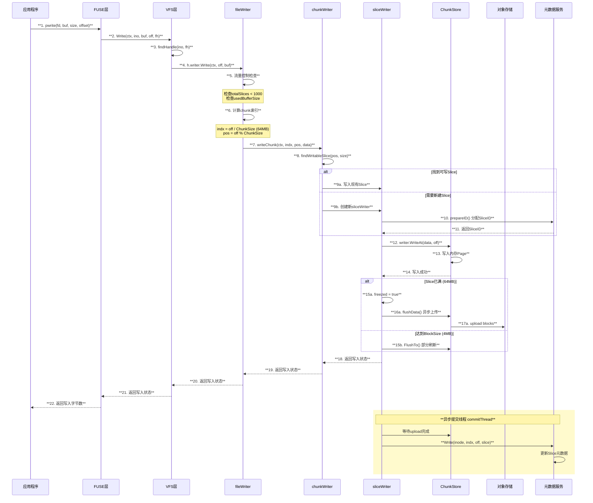

# JuiceFS pwrite 系统调用实现分析

## 概述

`pwrite` 是 POSIX 标准的系统调用，用于在文件的指定偏移量处写入数据。在 JuiceFS 中，pwrite 通过 FUSE 接口接收请求，经过多层处理后将数据写入对象存储，并更新元数据。

## 架构图

```mermaid
graph TB
    subgraph "用户态"
        A[**应用程序<br/>pwrite()**]
    end
    
    subgraph "FUSE 层"
        B[**go-fuse<br/>Write Handler**]
    end
    
    subgraph "VFS 层"
        C[**VFS.Write<br/>虚拟文件系统**]
        D[**Handle<br/>文件句柄**]
    end
    
    subgraph "Writer 层"
        E[**fileWriter<br/>文件写入器**]
        F[**chunkWriter<br/>Chunk写入器**]
        G[**sliceWriter<br/>Slice写入器**]
    end
    
    subgraph "ChunkStore 层"
        H[**wSlice<br/>写入缓冲**]
        I[**内存Page<br/>64KB**]
    end
    
    subgraph "持久化"
        J[**对象存储<br/>S3/MinIO等**]
        K[**元数据服务<br/>Redis/MySQL等**]
    end
    
    A --> B
    B --> C
    C --> D
    D --> E
    E --> F
    F --> G
    G --> H
    H --> I
    I -.->|异步上传| J
    G -.->|提交Slice| K
    
    style A fill:#ffe1e1,stroke:#333,stroke-width:2px,color:#000
    style B fill:#e1ffe1,stroke:#333,stroke-width:2px,color:#000
    style C fill:#e1f5ff,stroke:#333,stroke-width:2px,color:#000
    style D fill:#e1f5ff,stroke:#333,stroke-width:2px,color:#000
    style E fill:#fff3e1,stroke:#333,stroke-width:2px,color:#000
    style F fill:#fff3e1,stroke:#333,stroke-width:2px,color:#000
    style G fill:#fff3e1,stroke:#333,stroke-width:2px,color:#000
    style H fill:#f5e1ff,stroke:#333,stroke-width:2px,color:#000
    style I fill:#f5e1ff,stroke:#333,stroke-width:2px,color:#000
    style J fill:#fffacd,stroke:#333,stroke-width:2px,color:#000
    style K fill:#fffacd,stroke:#333,stroke-width:2px,color:#000
```

## 时序图



## 函数调用链

```
pwrite() - 系统调用入口
└── fs.Write() - pkg/fuse/fuse.go:273
    └── VFS.Write() - pkg/vfs/vfs.go:796
        ├── findHandle(ino, fh) - 查找文件句柄
        ├── h.Wlock(ctx) - 获取写锁
        └── h.writer.Write(ctx, off, buf) - pkg/vfs/writer.go:295
            ├── 流量控制
            │   ├── totalSlices() < 1000 检查
            │   └── usedBufferSize() 检查
            ├── 计算chunk索引: indx = off / ChunkSize
            └── writeChunk(ctx, indx, pos, data) - pkg/vfs/writer.go:258
                ├── findChunk(indx) - 查找或创建chunkWriter
                ├── findWritableSlice(pos, size) - pkg/vfs/writer.go:160
                │   └── 查找可追加写入的slice
                ├── 创建新sliceWriter (如需要) - pkg/vfs/writer.go:262
                │   ├── store.NewWriter(0) - 创建chunk writer
                │   └── prepareID() - 异步分配SliceID
                │       └── meta.NewSlice() - 元数据服务分配ID
                └── sliceWriter.write(ctx, off, data) - pkg/vfs/writer.go:127
                    ├── writer.WriteAt(data, off) - pkg/chunk/cached_store.go:297
                    │   └── ┌──────────────┬────────────────────────────────────────┐
                    │       │  **操作**     │  **说明**                              │
                    │       ├──────────────┼────────────────────────────────────────┤
                    │       │  边界检查     │  off+len(p) <= chunkSize (64MB)        │
                    │       ├──────────────┼────────────────────────────────────────┤
                    │       │  计算块索引   │  indx = (off+n) / BlockSize            │
                    │       ├──────────────┼────────────────────────────────────────┤
                    │       │  分配Page     │  allocPage(pageSize) - 64KB            │
                    │       ├──────────────┼────────────────────────────────────────┤
                    │       │  拷贝数据     │  copy(page.Data[bo:], p[n:])           │
                    │       ├──────────────┼────────────────────────────────────────┤
                    │       │  更新长度     │  s.length = off + n                    │
                    │       └──────────────┴────────────────────────────────────────┘
                    ├── 检查是否需要刷新
                    │   ├── slen == ChunkSize → freezed, 异步flushData()
                    │   └── slen >= BlockSize → FlushTo() 刷新已完成块
                    └── 启动commitThread() (首个slice时)
                        └── 提交元数据循环
                            ├── 等待slice.done
                            ├── meta.Write() - 更新slice元数据
                            └── reader.Invalidate() - 失效读缓存
```

## 核心数据结构

### 写入层次结构

| 层级 | 结构体 | 作用 | 大小限制 |
|------|--------|------|----------|
| 文件级 | `fileWriter` | 管理单个文件的所有写入 | 无 |
| Chunk级 | `chunkWriter` | 管理64MB的Chunk | 64MB |
| Slice级 | `sliceWriter` | 管理单次连续写入 | ≤64MB |
| Block级 | `wSlice` | 管理4MB的Block | 4MB |
| Page级 | `Page` | 内存页 | 64KB |

### 关键字段说明

```go
type sliceWriter struct {
    id      uint64       // Slice唯一ID，由元数据服务分配
    chunk   *chunkWriter // 所属chunkWriter
    off     uint32       // 在Chunk内的起始偏移
    length  uint32       // 已上传的数据长度
    soff    uint32       // slice内偏移
    slen    uint32       // 当前写入的长度
    writer  chunk.Writer // 底层ChunkStore写入器
    freezed bool         // 是否冻结(不再接受写入)
    done    bool         // 是否完成上传
    err     syscall.Errno // 错误状态
}
```

## 写入流程详解

### 1. 流量控制

```go
// pkg/vfs/writer.go:295-308
func (f *fileWriter) Write(ctx meta.Context, off uint64, data []byte) syscall.Errno {
    // 限制并发slice数量，防止内存溢出
    for {
        if f.totalSlices() < 1000 {
            break
        }
        time.Sleep(time.Millisecond)
    }
    // 限制缓冲区大小
    if f.w.usedBufferSize() > f.w.bufferSize {
        time.Sleep(time.Millisecond * 10)
        for f.w.usedBufferSize() > f.w.bufferSize*2 {
            time.Sleep(time.Millisecond * 100)
        }
    }
    ...
}
```

### 2. 数据分片

数据按照64MB的Chunk大小进行分片：

```go
// pkg/vfs/writer.go:324-337
indx := uint32(off / meta.ChunkSize)  // ChunkSize = 64MB
pos := uint32(off % meta.ChunkSize)
for len(data) > 0 {
    n := uint32(len(data))
    if pos+n > meta.ChunkSize {
        n = meta.ChunkSize - pos  // 不跨Chunk边界
    }
    if st := f.writeChunk(ctx, indx, pos, data[:n]); st != 0 {
        return st
    }
    data = data[n:]
    indx++
    pos = (pos + n) % meta.ChunkSize
}
```

### 3. 异步上传

当数据达到Block大小(4MB)或Slice满(64MB)时触发上传：

```go
// pkg/vfs/writer.go:138-149
if s.slen == meta.ChunkSize {
    s.freezed = true
    go s.flushData()  // 异步上传整个Slice
} else if int(s.slen) >= f.w.blockSize {
    if s.id > 0 {
        err := s.writer.FlushTo(int(s.slen))  // 刷新已完成的Block
    }
}
```

### 4. 元数据提交

`commitThread` 负责按顺序提交Slice元数据：

```go
// pkg/vfs/writer.go:182-220
func (c *chunkWriter) commitThread() {
    for len(c.slices) > 0 {
        s := c.slices[0]
        for !s.done {
            s.notify.WaitWithTimeout(time.Millisecond*100)
        }
        if err == 0 {
            var ss = meta.Slice{Id: s.id, Size: s.length, Off: s.soff, Len: s.slen}
            err = f.w.m.Write(meta.Background(), f.inode, c.indx, s.off, ss, s.lastMod)
            f.w.reader.Invalidate(...)  // 失效读缓存
        }
        c.slices = c.slices[1:]
    }
}
```

## 对象存储写入

### Block上传流程

```go
// pkg/chunk/cached_store.go:430-497
func (s *wSlice) upload(indx int) {
    go func() {
        // 合并Pages为一个Block
        block := NewOffPage(blen)
        for _, b := range pages {
            off += copy(block.Data[off:], b.Data)
        }
        
        if s.writeback {
            // Writeback模式：先写本地缓存
            stagingPath, err = s.store.bcache.stage(key, block.Data, ...)
            if err == nil {
                s.errors <- nil
                // 延迟上传到对象存储
                s.store.addDelayedStaging(key, stagingPath, time.Now(), false)
                return
            }
        }
        
        // 直接上传到对象存储
        s.errors <- s.store.upload(key, block, s)
    }()
}
```

## 关键特性

### 1. 写入缓冲
- 数据首先写入64KB的内存Page
- 累积到4MB(BlockSize)后触发上传
- 支持Writeback模式，先写本地SSD缓存

### 2. 并发控制
- 限制总Slice数量 < 1000
- 限制内存缓冲区大小
- FlushWaiting/WriteWaiting 互斥机制

### 3. 元数据延迟提交
- 数据上传完成后才提交元数据
- 保证数据一致性
- 支持自动Compaction

### 4. 错误处理
- 上传失败重试 (MaxRetries次)
- 写入错误传播到上层
- 支持写入中断 (EINTR)

## 性能优化

| 优化点 | 实现方式 |
|--------|----------|
| 异步上传 | goroutine异步上传Block |
| 批量写入 | 累积4MB再上传 |
| 内存复用 | Page池化分配 |
| 写入合并 | 同一Slice内连续写入合并 |
| 本地缓存 | Writeback模式先写SSD |

