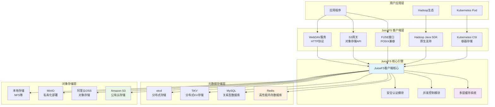
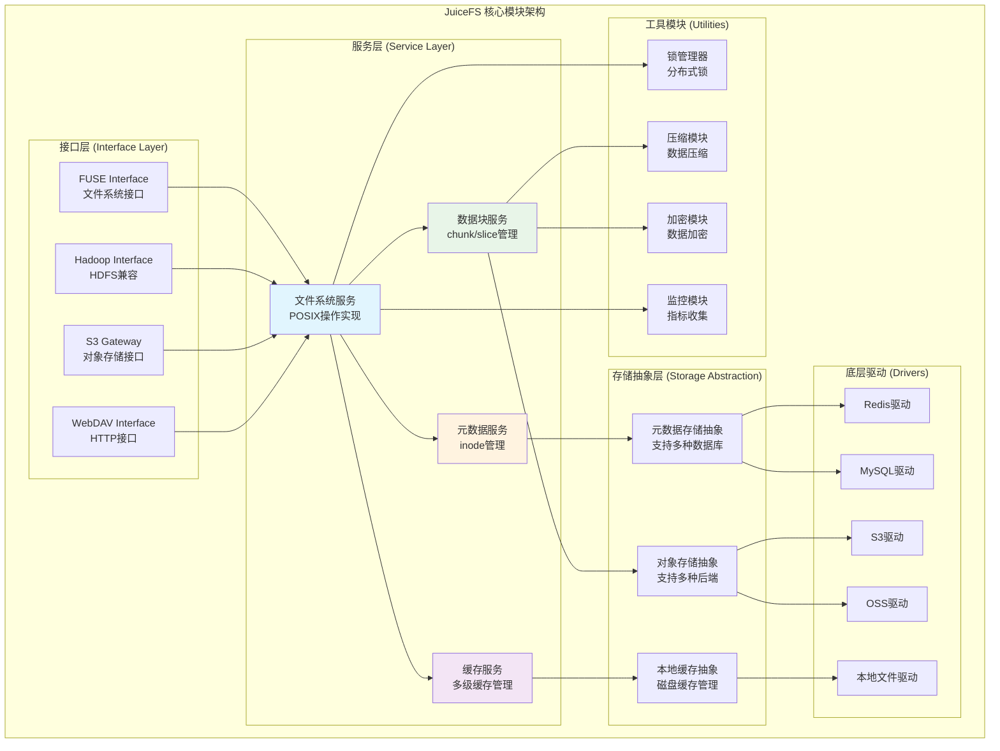
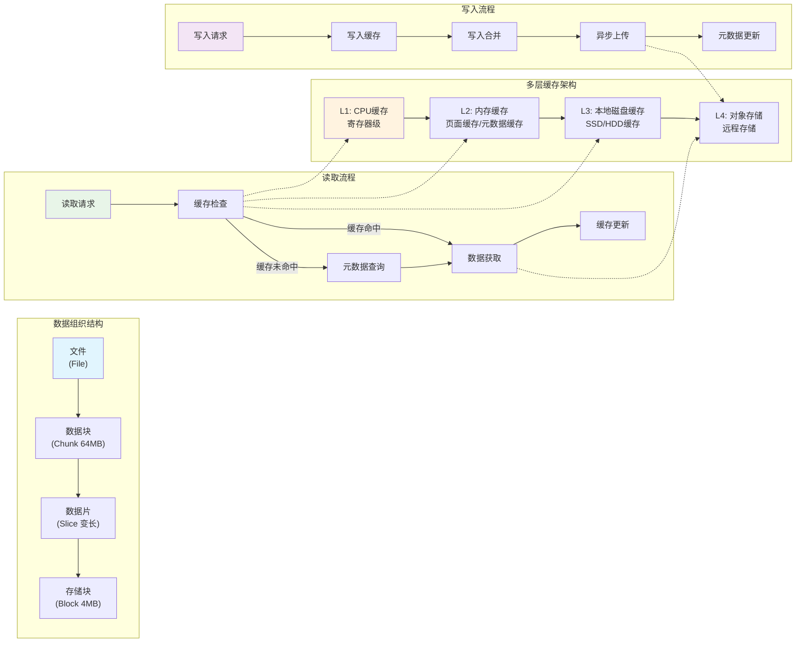
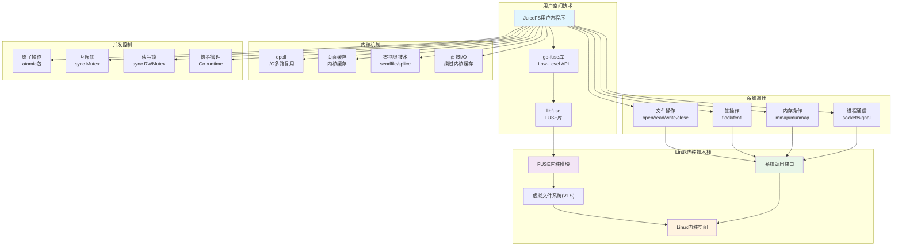

# JuiceFS 架构原理与Linux技术分析

## 概述

JuiceFS 是一个基于 Redis 和对象存储构建的分布式 POSIX 文件系统。它采用数据与元数据分离的架构设计，通过 FUSE 实现用户态文件系统，为用户提供了高性能、高可用的文件存储解决方案。

## 1. 系统架构

### 1.1 整体架构图

JuiceFS 采用三层架构设计：

```
用户应用层 → JuiceFS客户端 → 存储后端（元数据引擎 + 对象存储）
```

#### 1.1.1 详细架构图

下图展示了 JuiceFS 的完整架构，包括多种接入方式、核心引擎和存储后端：



### 1.2 核心组件

#### 1.2.1 JuiceFS 客户端
JuiceFS 客户端是系统的核心，负责协调元数据引擎和对象存储，提供多种接入方式：

- **FUSE 接口**: 通过 Linux FUSE 机制实现 POSIX 兼容的文件系统接口
- **Hadoop Java SDK**: 为 Hadoop 生态提供原生支持，可替代 HDFS
- **Kubernetes CSI 驱动**: 为容器化环境提供持久化存储
- **S3 网关**: 提供 S3 兼容的对象存储接口
- **WebDAV 服务**: 通过 HTTP 协议提供文件访问能力

#### 1.2.2 核心模块详细架构

下图展示了 JuiceFS 客户端内部的模块组织结构：



#### 1.2.3 元数据引擎
负责存储文件系统的元数据信息，支持多种数据库：

- **Redis**: 高性能内存数据库，适合频繁的元数据操作
- **关系型数据库**: MySQL、PostgreSQL、SQLite 等
- **分布式 KV 存储**: TiKV、etcd、BadgerDB 等

元数据包含：
- 文件系统元数据：文件名、大小、权限、时间戳、目录结构等
- JuiceFS 特有元数据：数据块映射、引用计数、客户端会话等

#### 1.2.4 对象存储
负责存储实际的文件数据，支持：
- 公有云对象存储：Amazon S3、阿里云 OSS、腾讯云 COS 等
- 私有化部署：MinIO、Ceph、OpenStack Swift 等
- 本地存储：本地文件系统、NFS 等

### 1.3 数据组织结构

JuiceFS 采用分层的数据组织方式：

```
File → Chunk (64MB) → Slice (变长) → Block (4MB)
```

- **Chunk**: 文件的逻辑分割单位，默认 64MB，便于大文件的随机访问
- **Slice**: 数据写入的逻辑单位，每次写入操作对应一个或多个 Slice  
- **Block**: 实际存储的最小单位，默认 4MB，存储在对象存储中

### 1.4 数据流处理与缓存架构

下图展示了 JuiceFS 的数据组织结构、多层缓存架构以及读写流程：



## 2. 核心技术原理

### 2.1 FUSE 用户态文件系统

JuiceFS 基于 Linux FUSE (Filesystem in Userspace) 技术实现：

- 使用 **Low-Level API**: 基于 inode 而非路径操作，避免频繁的路径解析
- **go-fuse 库**: 使用 Go 语言的 FUSE 实现，提供更好的性能和稳定性
- **系统调用拦截**: 拦截内核的文件系统调用，转发给用户态程序处理

### 2.2 元数据管理

#### 2.2.1 元数据结构设计
- **Inode 映射**: 每个文件对应唯一的 inode 号
- **目录树结构**: 通过父子关系维护文件系统层次结构  
- **属性缓存**: 客户端缓存文件属性以减少元数据访问

#### 2.2.2 事务处理
- **原子操作**: 关键元数据操作使用数据库事务保证一致性
- **乐观锁**: 使用版本号或时间戳实现乐观并发控制
- **分布式锁**: 支持文件锁定机制，确保并发访问安全

### 2.3 数据缓存机制

JuiceFS 实现了多层缓存架构：

#### 2.3.1 内存缓存
- **页面缓存**: 缓存最近访问的数据块
- **元数据缓存**: 缓存 inode 属性和目录项
- **LRU 策略**: 使用最近最少使用算法管理缓存

#### 2.3.2 磁盘缓存  
- **本地缓存**: 在本地磁盘缓存热点数据
- **预读机制**: 顺序读取时预加载后续数据块
- **写缓存**: 合并小的写操作以提高性能

### 2.4 并发控制

#### 2.4.1 文件级锁定
- **Advisory Locks**: 支持 flock() 和 fcntl() 文件锁
- **强制锁**: 可选的强制文件锁定机制
- **分布式锁**: 跨客户端的锁定协调

#### 2.4.2 并发读写
- **读写锁**: 支持多读者单写者模式
- **原子操作**: 使用 atomic 包实现无锁数据结构
- **协程管理**: 利用 Go 协程实现高并发处理

## 3. Linux 内核技术应用

### 3.1 Linux 技术栈架构

下图展示了 JuiceFS 与 Linux 内核技术栈的集成关系：



### 3.2 系统调用接口

JuiceFS 广泛使用 Linux 系统调用：

```go
// 文件操作系统调用
syscall.Open()
syscall.Read() 
syscall.Write()
syscall.Close()

// 文件锁定系统调用  
syscall.Flock()
syscall.Fcntl()

// 内存管理系统调用
syscall.Mmap()
syscall.Munmap()
```

### 3.3 文件锁定机制

#### 3.3.1 Advisory Locks
- **flock()**: 整个文件的建议性锁定
- **fcntl()**: 记录锁定，支持部分文件锁定
- **跨进程锁**: 支持多进程间的锁定协调

#### 3.3.2 锁定实现
```go
// Redis 实现的分布式文件锁
func (r *redisMeta) Flock(ctx Context, inode Ino, owner uint64, ltype uint32, block bool) syscall.Errno {
    // 在 Redis 中维护锁定信息，支持读写锁
    // 实现阻塞和非阻塞锁定模式
}
```

### 3.4 内存管理

#### 3.4.1 零拷贝技术
- **页面共享**: 多个进程共享相同的内存页面
- **Direct I/O**: 绕过内核缓存直接访问存储设备
- **内存映射**: 使用 mmap 进行高效的文件映射

#### 3.4.2 缓存管理
- **页面缓存**: 利用内核的页面缓存机制
- **预读**: 实现智能的数据预读策略
- **回写**: 延迟写入以提高性能

### 3.5 进程间通信

#### 3.5.1 Unix 域套接字
```go
// 用于 FUSE 文件描述符传递
func putFd(via *net.UnixConn, msg []byte, fds ...int) error {
    rights := syscall.UnixRights(fds...)
    return syscall.Sendmsg(socket, msg, rights, nil, 0)
}
```

#### 3.5.2 信号处理
- **优雅关闭**: 处理 SIGTERM 信号实现优雅关闭
- **热重载**: 支持配置热重载而不中断服务

### 3.6 I/O 多路复用

虽然 JuiceFS 主要使用 Go 的协程模型，但底层仍然依赖：
- **epoll**: Linux 下高效的 I/O 事件通知机制
- **异步 I/O**: 非阻塞 I/O 操作提高并发性能

## 4. 性能优化技术

### 4.1 并发优化

#### 4.1.1 协程池
- **工作池模式**: 使用协程池处理 I/O 密集型任务
- **单飞模式**: 避免重复请求的 singleflight 实现
- **流水线**: 读取、处理、写入的流水线并行

#### 4.1.2 锁优化
- **读写锁**: 区分读写操作，提高并发度
- **无锁数据结构**: 使用 atomic 操作避免锁竞争
- **锁分片**: 将大锁拆分为多个小锁减少竞争

### 4.2 缓存优化

#### 4.2.1 多级缓存
```go
// 缓存层次结构
内存缓存 → 本地磁盘缓存 → 对象存储
```

#### 4.2.2 缓存策略
- **预读**: 顺序访问时预加载数据
- **写合并**: 将小写操作合并为大块写入
- **延迟写**: 延迟写入以提高吞吐量

### 4.3 网络优化

#### 4.3.1 连接复用
- **HTTP/2**: 使用 HTTP/2 多路复用减少连接开销
- **连接池**: 维护到对象存储的连接池
- **断线重连**: 自动重连机制保证服务可用性

#### 4.3.2 数据压缩
- **传输压缩**: 可选的数据压缩以减少网络传输
- **差异同步**: 只传输变化的数据块

## 5. 高可用与容错设计

### 5.1 元数据高可用
- **主从复制**: Redis 主从复制保证元数据可用性
- **集群模式**: 支持 Redis Cluster 和数据库集群
- **自动故障转移**: 客户端自动检测并切换到可用节点

### 5.2 数据一致性
- **强一致性**: 元数据操作保证强一致性
- **最终一致性**: 数据缓存采用最终一致性模型
- **版本控制**: 使用版本号检测和解决冲突

### 5.3 容错恢复
- **会话恢复**: 客户端重启后恢复文件句柄
- **数据校验**: 使用校验和检测数据完整性
- **自动修复**: 自动检测和修复损坏的数据

## 6. 监控与运维

### 6.1 指标监控
- **Prometheus 集成**: 暴露详细的性能指标
- **实时监控**: 监控 I/O 性能、缓存命中率等
- **告警机制**: 关键指标异常时自动告警

### 6.2 日志管理
- **结构化日志**: 使用结构化格式便于分析
- **日志级别**: 支持多种日志级别控制
- **访问日志**: 记录所有文件访问操作

### 6.3 运维工具
- **状态查看**: `juicefs status` 查看系统状态
- **性能分析**: `juicefs profile` 性能分析工具
- **数据迁移**: `juicefs sync` 数据同步工具

## 7. 安全特性

### 7.1 数据加密
- **静态加密**: 数据在对象存储中的加密
- **传输加密**: HTTPS/TLS 加密传输
- **密钥管理**: 安全的密钥存储和轮换

### 7.2 访问控制
- **POSIX ACL**: 支持标准的 POSIX 访问控制列表
- **用户认证**: 多种用户认证机制
- **权限检查**: 严格的权限检查机制

## 8. 架构图表总结

### 8.1 系统架构概览

本文档通过多个架构图展示了 JuiceFS 的完整技术体系：

1. **整体架构图** - 展示了从用户应用层到存储后端的完整架构
2. **核心模块架构图** - 详细描述了客户端内部的模块组织结构  
3. **数据流处理图** - 说明了数据组织结构和多层缓存机制
4. **Linux技术栈图** - 展示了与Linux内核技术的深度集成

### 8.2 模块关系总结

#### 8.2.1 分层架构设计
- **接口层**: 提供多种访问接口（FUSE、Hadoop SDK、S3网关等）
- **服务层**: 核心业务逻辑（文件系统服务、元数据服务、数据块服务）
- **存储抽象层**: 统一的存储接口抽象
- **驱动层**: 具体的存储后端实现

#### 8.2.2 核心组件交互
- **元数据引擎**: 负责文件系统元数据的存储和管理
- **对象存储**: 负责实际文件数据的存储
- **多层缓存**: 提供从CPU缓存到对象存储的完整缓存体系
- **并发控制**: 通过锁机制和原子操作保证数据一致性

### 8.3 操作系统技术集成

#### 8.3.1 Linux内核技术应用
- **FUSE框架**: 用户态文件系统的核心技术
- **系统调用**: 充分利用文件操作、锁定、内存管理等系统调用
- **内核机制**: 应用epoll、页面缓存、零拷贝等高效机制
- **并发控制**: 结合Go语言特性实现高效并发

#### 8.3.2 性能优化策略
- **多级缓存**: 从CPU缓存到远程存储的层次化缓存设计
- **异步处理**: 通过异步上传和写入合并提高性能
- **连接复用**: HTTP/2多路复用和连接池技术
- **预读机制**: 智能的数据预读和缓存策略

## 9. 总结

JuiceFS 通过巧妙的架构设计和对 Linux 内核技术的充分利用，实现了一个高性能、高可用的分布式文件系统：

### 9.1 技术特点
- **数据元数据分离**: 充分利用各种存储的优势
- **FUSE 用户态实现**: 避免内核修改，提高可维护性
- **多层缓存架构**: 显著提升访问性能
- **丰富的接入方式**: 满足不同场景需求

### 9.2 Linux 技术应用
- **FUSE 文件系统**: 用户态文件系统的核心技术
- **系统调用**: 充分利用 Linux 系统调用接口
- **并发控制**: 文件锁定和原子操作
- **内存管理**: 高效的缓存和内存映射
- **进程通信**: Unix 域套接字等 IPC 机制

### 9.3 创新点
- **Go 语言实现**: 充分利用 Go 的并发优势
- **云原生设计**: 天然适合云环境部署
- **水平扩展**: 支持多客户端、多存储后端
- **生态兼容**: 与现有系统无缝集成

JuiceFS 的成功证明了在用户态实现高性能文件系统的可行性，为现代分布式存储系统的设计提供了有价值的参考。
